# MAPA 2.0 · Estudio detallado por zonas

Tercer documento del proyecto, después del mapa (hoja 1) y de las tablas (hojas 2 y 3). Aquí no hay columnas: hay texto. Cada zona se explica como si fuera yo quien tuviera que dejar Mancor de la Vall e irme a vivir allí, con lo que tendría y lo que no tendría, y después cada municipio uno por uno. El orden es el de la tabla, de arriba abajo: Pontevedra (Baixo Miño, Val Miñor, Vigo e ría, O Morrazo, Pontevedra e Sanxenxo, O Salnés), A Coruña (Barbanza e Noia, Golfo Ártabro e Ferrol), Lugo (A Mariña), Asturias (Occidente, Centro, Oriente), Cantabria (Occidental, Oriental) y Portugal (Alto Minho, Litoral Norte).

Cada zona empieza con su mapa. Todos los mapas siguen el mismo patrón: a la izquierda la zona ampliada, con los términos municipales de la tabla sombreados en amarillo y numerados (el número es la fila de la tabla), los hospitales (cuadrado con H: rojo público, granate privado), los aeropuertos (triángulo gris), las autopistas (rojo), las carreteras principales (gris discontinuo), las ciudades de referencia (cuadrado negro) y los lugares que se nombran en el texto: playas (triángulo azul), montes y miradores (triángulo verde), paseos (rombo verde), balnearios, campos de golf y barcos de pasajeros. Arriba a la derecha, un localizador del norte peninsular con la zona marcada; debajo, la lista de municipios con horas de sol y minutos a hospital y aeropuerto; y en la base, la leyenda, igual en todos. Cuando la zona toca Portugal, Portugal aparece en color más oscuro.

Convenciones del texto: el sol se da como horas al año y días despejados (cielo limpio casi todo el día), y siempre con el dato de Mancor al lado; la lluvia, en días al mes por temporada, con el mes peor señalado; cada playa, monte o paseo lleva la distancia en kilómetros y minutos de coche desde el pueblo, y está en el mapa. Las zonas 1 y 2 ya están en este formato; de la 3 a la 16 conservan por ahora el formato anterior y se irán rehaciendo con el mismo patrón.

Los números de sol, lluvia, hospital, aeropuerto, servicios y precios son los de `data/municipios.csv`. Los días de lluvia por mes, las temperaturas mensuales y los días por encima de 30 °C son valores climatológicos de referencia (AEMET / IPMA, normales 1991-2020 de las estaciones más próximas) redondeados; todavía no están en la tabla. La tasa de criminalidad es la del Balance de Criminalidad 2025 del Ministerio del Interior (solo municipios de más de 20.000 habitantes; en el resto se indica la de la comunidad autónoma).

## La referencia: Mancor de la Vall y Mallorca

Para comparar hay que tener a mano lo que dejas:

| | Mancor de la Vall |
|---|---|
| Sol | 2.800 h/año; unos 120 días despejados y 60 cubiertos |
| Lluvia | 455-700 mm; unos 55-60 días al año: 6-8 días al mes de octubre a enero, 1-2 en julio y agosto |
| Verano | Máxima media de julio 29,6 °C; 37 días > 30 °C; noches de 20-22 °C |
| Invierno | Enero 7,9 / 13,7 °C; sin heladas |
| Mar | 40 min; agua 25-27 °C en agosto |
| Ciudad | Inca (36.000 hab.) a 5 min; Palma a 40-60 min |
| Hospital | Comarcal de Inca a 5 min; Son Espases a 45-60 min |
| Aeropuerto | Palma a 40 min |
| Seguridad | Inca 36 infracciones por 1.000 hab.; Palma 88; Calvià 100 |
| Población | 1.700 hab.; Baleares 21,7 % de extranjeros |
| Casa | Casas bajas, piedra, terraza grande al sol, monte detrás |

Las dos verdades generales antes de entrar en cada zona:

1. **Invierno.** En toda la costa norte llueve entre 12 y 16 días al mes de octubre a marzo (en Mancor, 6-8). Eso significa que en invierno la terraza se usa la mitad o menos. Las temperaturas de invierno, en cambio, son casi las mismas que en Mancor (6-8 °C de mínima, 13-14 °C de máxima en enero) porque el mar templa la costa.
2. **Verano.** En las Rías Baixas y en el Minho llueve 3-5 días al mes de junio a agosto y hay 3-8 días al año por encima de 30 °C; en el Cantábrico llueve 9-11 días al mes en verano y hay 1-3 días por encima de 30 °C. En Mancor, 37 días. El calor que no quieres desaparece en todas las zonas costeras de la tabla; solo vuelve en los valles interiores del Miño (Tui, Tomiño, Valença, Ponte de Lima).

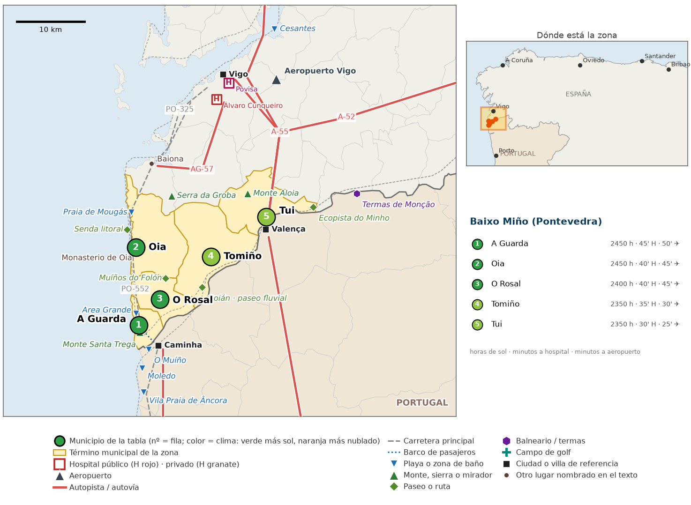

## 1. Baixo Miño (Pontevedra) · A Guarda, Oia, O Rosal, Tomiño, Tui

### La zona

Es la esquina suroeste de Galicia: el último tramo del río Miño antes de entrar en el Atlántico, con Portugal en la otra orilla. Mirando al mar están A Guarda, una villa de pescadores apretada en la punta donde el río se rinde al océano, y Oia, una hilera de aldeas colgadas entre la sierra y las rocas. Tierra adentro, siguiendo el río hacia arriba, vienen el valle de O Rosal (viñedo, molinos, casas de piedra), las vegas de Tomiño con Goián asomado a Portugal, y Tui, la pequeña ciudad episcopal que se mira en Valença. Detrás de todo, la Serra da Groba (660 m) y el Monte Aloia (629 m); sobre A Guarda, el Monte Santa Trega (341 m), que es el balcón natural de toda la desembocadura.

Es la zona de la tabla que más se parece a Mancor en textura: granito, bancales de viñedo, casas de piedra repartidas en parroquias, monte detrás del pueblo y un ritmo lento. También es la más rural: la ciudad (Vigo) está a 40 minutos y el hospital a 30-45. A cambio, Portugal a cinco minutos multiplica lo que tienes a mano: Valença (comercio, restaurantes, el mercado de toallas y manteles dentro de la fortaleza), Vila Nova de Cerveira (mercado de los sábados, paseo junto al río), Caminha y Vila Praia de Âncora (playas y vida de villa), y la sanidad privada portuguesa, bastante más barata que la española.

### Clima: qué notarás respecto a Mancor

Cómo leer los números de sol: primero las horas de sol al año y después los días despejados (cielo limpio casi todo el día) y los cubiertos (cielo tapado casi todo el día); el resto del año son días de nubes y claros.

| | Oct-Mar | Abr-May | Jun-Sep | Año |
|---|---|---|---|---|
| Días de lluvia al mes · **Baixo Miño** | 13-16 (el peor, diciembre-enero: 16-17) | 10-12 | 3-6 (julio: 3) | 118-122 |
| Días de lluvia al mes · Mancor | 6-8 | 4-5 | 1-3 | 55-60 |
| Horas de sol al mes · **Baixo Miño** | 100-140 (diciembre: 95-100, 3 h al día) | 200-230 | 260-300 (julio: 300, casi 10 h al día) | 2.350-2.450 |
| Horas de sol al mes · Mancor | 150-205 | 235-285 | 230-345 | 2.800 |
| Máxima / mínima típica · **Baixo Miño** | 14 / 7 °C (enero) | 19 / 10 °C | 25 / 15 °C en la costa · 28-29 / 15 °C en Tui | |
| Máxima / mínima típica · Mancor | 14 / 6 °C (enero) | 22 / 11 °C | 30 / 20 °C (julio) | |

- **Sol: 2.350-2.450 h al año / 75-78 días despejados (115 cubiertos).** Mancor: 2.800 h / 120 despejados (60 cubiertos). Pierdes 350-450 horas de sol, casi todas entre noviembre y febrero: de junio a septiembre la diferencia es pequeña (aquí 260-300 h al mes, en Mancor 230-345). En verano tomarás el sol en la terraza igual que ahora; en invierno, la mitad de días.
- **Lluvia: 1.500-1.650 mm en 118-122 días.** En Mancor caen 455-700 mm en 55-60 días. Es decir: llueve el doble de días y cae casi tres veces más agua, porque aquí, cuando llueve, llueve en serio. De octubre a marzo cuenta con 13-16 días de lluvia al mes (diciembre y enero son los peores, 16-17); en abril y mayo 10-12; de junio a septiembre 3-6, con julio prácticamente seco.
- **Temperatura.** Invierno casi idéntico a Mancor (enero 14 / 7 °C, sin heladas en la costa; en Tui y Tomiño alguna helada de madrugada). Verano mucho más suave en la costa: 25 °C de máxima típica en julio en A Guarda y Oia frente a los 30 de Mancor, y noches de 15 °C en lugar de 20-22.
- **Calor.** En A Guarda y Oia, 5 días al año por encima de 30 °C (Mancor: 37). En Tui y Tomiño, 15-20 días, con puntas de 36-38 °C en las olas de calor: los valles del Miño son la única parte gallega de la tabla donde vuelve algo del verano que quieres dejar atrás.
- **Viento y niebla.** Viento medio en A Guarda (la punta está expuesta al noroeste) y bajo en el valle. Niebla baja en la costa; media en Tomiño y Tui, con nieblas de río en mañanas de otoño e invierno que levantan a media mañana.

### Mar y baño

La costa de Oia es Atlántico puro: rocas oscuras, oleaje, acantilados bajos y el ruido del mar de fondo. Es una costa para pasear, no para nadar. Para bañarse con calma hay que ir a la desembocadura del Miño o cruzar a Portugal.

- **Area Grande (A Guarda · 1,5 km · 4 min desde el centro, se va andando).** Cala de arena fina abrigada entre rocas al norte del casco urbano, con paseo de madera y el Santa Trega detrás. Es la playa "de diario" de A Guarda. Agua a 17-19 °C en agosto: fresca, pero se aguanta.
- **O Muíño (A Guarda-Camposancos · 3 km · 6 min).** Ya dentro del estuario del Miño, con Portugal enfrente y agua tranquila sin olas, algo más templada que la costa abierta. Merendero bajo los pinos y un pequeño puerto donde sale el barco a Caminha.
- **Praia de Mougás (Oia · 6 km · 8 min desde el centro de Oia).** Pequeña, mezcla de arena y cantos, batida por el oleaje. Para mojarse los pies y mirar el océano, no para nadar. Desde Oia, la playa de baño real es la de Baiona (14 km · 18 min, zona 2).
- **Cesantes (Redondela, ría de Vigo · 30 km · 25 min desde Tui, 38 km · 30 min desde Goián por la A-55 y la AP-9).** Playa larga de arena en el fondo de la ría, frente a la isla de San Simón, sin oleaje y con el agua más templada de la zona (18-20 °C). Es la playa cómoda para Tui y Tomiño.
- **Moledo y Vila Praia de Âncora (Portugal · 35-40 km · 40-45 min en coche por el puente de Goián-Cerveira; o 15 min de barco desde A Guarda a Caminha más 5-8 km).** Arenales atlánticos largos con dunas y pinar, Moledo con el fuerte de la Ínsua delante y Vila Praia de Âncora con puerto pesquero y vida de villa. Agua abierta, fría, oleaje moderado.

En el mapa, las playas son los triángulos azules invertidos y el barco A Guarda-Caminha la línea de puntos azul (servicio estacional: hay que comprobar cada temporada si funciona).

### Paseos y montaña

- **Monte Santa Trega (A Guarda · 5 km · 10 min en coche hasta arriba, o una hora subiendo a pie desde el pueblo).** Un monte redondo de 341 m que cae directamente sobre la desembocadura. En la ladera está el castro: un poblado fortificado de la Edad del Hierro (siglos IV a.C. a I d.C.) con decenas de casas circulares de piedra, algunas reconstruidas con techo de paja, que se recorren por callejuelas entre los muros. Arriba hay un museo arqueológico pequeño, una ermita y un mirador desde el que se ve el Miño abriéndose al océano, la costa portuguesa hasta Viana y, en días claros, las Cíes. Es el sitio al que llevarías a cualquier visita.
- **Senda litoral A Guarda-Oia-Baiona (unos 30 km, se hace por tramos).** Es el Camino Portugués de la Costa: un camino junto al mar, en parte pasarela de madera y en parte pista, que pasa por las aldeas de Portecelo y Mougás, el monasterio de Oia y el faro de Cabo Silleiro. Llano, con el Atlántico siempre a la izquierda y la Groba a la derecha. Cualquier tramo de 5-6 km es un paseo de tarde.
- **Muíños do Folón e do Picón (O Rosal · 4 km · 7 min desde O Rosal, 10 min desde A Guarda).** Sesenta y siete molinos de agua de los siglos XVII y XVIII, escalonados en dos regueros que bajan por la ladera, declarados Bien de Interés Cultural. La ruta es un circuito de 4-5 km entre molinos, pequeñas cascadas y viñedo, con el valle de O Rosal y el Miño abajo. Es el paseo más "de Mancor" de toda la tabla.
- **Serra da Groba (Alto da Groba · 12 km · 20 min desde Oia por Torroña; 10 km · 15 min desde Baiona).** Meseta granítica de 600-660 m con brezo y tojo, sin árboles, donde pastan los garranos, los caballos salvajes gallegos. En primavera se celebran los curros (la rapa das bestas): se bajan los caballos del monte, se marcan y se les corta la crin, en Mougás y Torroña. Desde arriba se ve el océano por un lado y el valle del Miño por el otro.
- **Parque Natural Monte Aloia (Tui · 8 km · 15 min desde Tui).** El primer parque natural de Galicia (1978): pinar y bosque de ribera sobre un monte de 629 m con senderos señalizados, áreas recreativas con mesas, la ermita de San Xián y varios miradores sobre la vega del Miño, Tui y Valença. Es donde los de Tui van a pasear el domingo.
- **Paseo fluvial del Miño en Goián (Tomiño · en el pueblo) y en Tui (en la ciudad).** Camino llano junto al río, con la fortaleza de San Lourenzo en Goián y el puente de la Amizade a Vila Nova de Cerveira. En Tui, el paseo va bajo la catedral hasta el puente internacional de hierro (1886).
- **Ecopista do Minho (Portugal · Valença-Monção, 15 km llanos · a 2 km del centro de Tui cruzando el puente).** Antigua vía de tren convertida en camino para andar o ir en bicicleta, entre viñedo de Alvarinho y el río. Al final, en Monção, unas termas municipales (25 km · 25 min desde Tui).

### Servicios: qué hay y qué falta

No hay ciudad en la comarca; hay dos villas con lo esencial (A Guarda y Tui) y tres municipios de parroquias que dependen de ellas.

- **A Guarda (10.000 hab.) · 6/10.** Tiene: centro de salud con urgencias 24 h (PAC), cuatro o cinco farmacias, supermercados medianos (Gadis, Froiz, Eroski, Lidl), mercado municipal y mercado semanal, puerto con lonja y restaurantes de marisco abiertos todo el año, bancos, colegios e instituto, biblioteca, polideportivo, piscina cubierta. Falta: hospital y especialistas (Vigo), gran superficie, cine, El Corte Inglés o similar, tren.
- **Tui (17.000 hab.) · 7/10.** Tiene: centro de salud con urgencias, farmacias, supermercados grandes (incluido uno a la salida hacia la A-55), casco histórico con comercio y cafeterías con vida todo el año por el Camino, instituto, conservatorio, estación de tren (regional a Vigo y Porto), y Valença enfrente con su propio comercio. Falta: hospital, cine, gran superficie (en Vigo, 30 min).
- **Tomiño (13.000 hab., núcleo en Goián) · 5/10.** Tiene: centro de salud, farmacias, supermercado, bares, panaderías, y Vila Nova de Cerveira a 2 minutos por el puente (mercado de los sábados, restaurantes, cafés). Falta: casi todo lo que no sea básico.
- **O Rosal (6.000 hab.) · 4/10.** Tiene: centro de salud, farmacia, supermercado pequeño, bares, panadería, bodegas. Falta: el resto, en A Guarda a 10 minutos.
- **Oia (3.000 hab.) · 3/10.** Tiene: consultorio médico, una farmacia, tiendas de pueblo, bares en Mougás y Oia. Falta: supermercado grande, instituto, casi todo. Dependencia total del coche.

Ciudad de referencia: **Vigo** (297.000 hab., 40 min desde A Guarda por la costa, 30 desde Tui por la A-55): hospitales, El Corte Inglés, AVE, aeropuerto, todo. Como Inca, pero a 40 minutos en vez de a 5.

### Sanidad

- **Público:** Hospital Álvaro Cunqueiro (Vigo), de referencia de toda Galicia sur: 30 min desde Tui, 35 desde Tomiño, 40 desde O Rosal y Oia, 45 desde A Guarda.
- **Privado:** Povisa (Vigo), 30-50 min. Vithas Vigo y Hospital Fátima, también en Vigo.
- **En Portugal:** hospital de Santa Luzia (Viana do Castelo, público portugués, fuera del SNS) a 35-40 min desde A Guarda; en Valença y Vila Nova de Cerveira hay clínicas privadas con precios más bajos que en España.
- Ningún hospital en la comarca. Es la peor sanidad de las Rías Baixas, aunque dentro de tu máximo de 45-60 min.

### Aeropuertos y Palma

- **Vigo-Peinador:** 25 min desde Tui, 30 desde Goián, 45 desde Oia y O Rosal, 50 desde A Guarda. Vuelo directo a Palma solo en verano (Vueling, unas cuatro frecuencias por semana de junio a septiembre).
- **Santiago:** 90-105 min. Vuelo a Palma casi todo el año.
- **Porto:** 90-100 min desde A Guarda por la A28. Vuelo a Palma en verano; gran aeropuerto para viajar a cualquier sitio.

### Precios y qué compras con 260.000 €

Los más bajos de las Rías Baixas: Tomiño 1.100 €/m², Tui 1.250, O Rosal 1.350, A Guarda 1.450, Oia 1.600.

- En A Guarda, un piso de 3 habitaciones con vistas al Miño y a menos de 5 min del mar ronda 170.000 €; en Oia, 187.000.
- En O Rosal y Tomiño (franja B), una casa de piedra rehabilitada con terreno y viñedo entra en 130.000-180.000 €.
- Obra nueva: solo en Tui; poca en A Guarda y O Rosal; ninguna en Oia.
- Con 260.000 € aquí es donde tiene más sentido la opción de dos viviendas.

### Seguridad y ambiente

Ninguno de los cinco supera los 20.000 habitantes, así que no tienen tasa propia publicada; Galicia está en 35 infracciones por 1.000 habitantes (la segunda comunidad más segura de España; Baleares, 61). Población extranjera en la provincia de Pontevedra alrededor del 5 % (Baleares, 21,7 %). Ambiente rural, gente local, poco tráfico salvo la PO-552 en verano. Turismo moderado en A Guarda (agosto) y en Tui (peregrinos del Camino todo el año, que dan vida sin llenar).

### Parecido con Mancor / Mallorca

Alto en paisaje y en forma de vida (pueblo pequeño, monte detrás, piedra, viñedo, tranquilidad): 4/5. Bajo en logística (ciudad y hospital lejos): 2/5. En clima: el sol más alto de Galicia junto al Val Miñor, pero con un invierno de 15 días de lluvia al mes que en Mancor no existe.

### Lo que no tendrás

- Hospital a menos de 30 min, ni ninguno en la comarca.
- Una ciudad a 5-15 min: Vigo está a 40.
- Vuelo a Palma todo el año a menos de 90 min.
- Urbanizaciones: el modelo es casa aislada en parroquia o piso en villa.
- Fibra segura en todas las parroquias (Oia, O Rosal y Tomiño: parcial).
- Verano suave en Tui y Tomiño: 15-20 días > 30 °C.
- Playa de arena grande y templada a menos de 20 min desde Tui y Tomiño.

### Municipio a municipio

#### 1 · A Guarda

Villa marinera de 10.000 habitantes en la punta donde el Miño entra en el Atlántico. El pueblo baja en cuesta hasta un puerto de bajura pequeño y muy vivo (la langosta es su emblema y tiene fiesta propia en julio), con la lonja, las casas de colores de los marineros y las terrazas del paseo. Detrás, siempre, el Santa Trega. Portugal está tan cerca que se oyen las campanas de Caminha.

- **Playas:** Area Grande (1,5 km · 4 min, andando), O Muíño en el estuario (3 km · 6 min), Praia da Lamiña. Agua 17-19 °C.
- **Paseos:** Santa Trega (castro y mirador), paseo marítimo del puerto a Camposancos (4 km llanos junto al mar), senda litoral hacia Oia, molinos del Folón en O Rosal a 10 min.
- **Servicios 6/10:** centro de salud con urgencias 24 h, farmacias, supermercados, mercado, colegios, piscina cubierta, puerto y restaurantes de marisco. Falta hospital, especialistas y gran superficie.
- **Sanidad y aeropuerto:** Álvaro Cunqueiro 45 min; Povisa 50. Vigo 50 min; Porto 95.
- **Precio:** 1.450 €/m². Piso reciente de 3 habitaciones con vistas al Miño, 170.000 €.
- **Casa que encontrarás:** piso en edificio bajo de los años 90-2010 con terraza al río o al puerto; chalé en las laderas hacia Camposancos con vistas a Portugal. Fibra sí. Viento medio: la punta está expuesta.
- **Para quién:** quien quiera una villa con vida propia, puerto y vistas a Portugal, y acepte el hospital a 45 min.

#### 2 · Oia

La costa más salvaje y solitaria de la tabla: 3.000 habitantes repartidos en siete parroquias colgadas entre la Serra da Groba y el Atlántico, sin un casco urbano de verdad. Su símbolo es el monasterio cisterciense de Santa María de Oia (siglo XII), plantado directamente frente al mar con los cañones que un día defendieron la costa. Al atardecer el sol se mete en el agua delante de casa.

- **Playas:** Mougás (6 km · 8 min; pequeña, oleaje) para mirar el mar; para bañarse, Baiona a 14 km · 18 min.
- **Paseos:** senda litoral (pasa por la puerta), petroglifos de la Groba, los curros de caballos salvajes en primavera, el Alto da Groba (12 km · 20 min).
- **Servicios 3/10:** consultorio, una farmacia, tiendas de pueblo y bares. Falta supermercado grande e instituto (en Baiona o A Guarda a 15-20 min). Dependencia del coche 8/10.
- **Sanidad y aeropuerto:** Álvaro Cunqueiro 40 min; Povisa 45. Vigo 45 min.
- **Precio:** 1.600 €/m². Sin obra nueva; casas de piedra rehabilitadas y algún chalé con vistas al océano.
- **Casa que encontrarás:** casa aislada en aldea con el mar delante y la sierra detrás; muy poco piso. Fibra parcial.
- **Para quién:** quien quiera vivir mirando al océano y le sobre la soledad. No tiene nada de Mancor salvo el silencio.

#### 3 · O Rosal

Valle interior a 10 minutos de A Guarda, con 6.000 habitantes, viñedo de Albariño y Loureiro en pérgola (las parras altas bajo las que se pasa andando), casas de piedra, y las cascadas de los molinos del Folón y del Picón. Es el municipio de la tabla que más se parece a Mancor en paisaje: valle cerrado, bancales, piedra, monte detrás (la Groba y el Santa Trega) y una plaza con bares donde todos se conocen.

- **Playas:** Area Grande a 7 km · 10 min (franja B). O Muíño a 8 km · 12 min.
- **Paseos:** Muíños do Folón (4 km · 7 min), Santa Trega (12 min), viñedos del valle, senda litoral en A Guarda.
- **Servicios 4/10:** centro de salud, farmacia, supermercado pequeño, bares, panadería, bodegas. Falta el resto: A Guarda a 10 min, Tui a 20.
- **Sanidad y aeropuerto:** Álvaro Cunqueiro 40 min; Povisa 45. Vigo 45 min.
- **Precio:** 1.350 €/m². Casa de piedra rehabilitada con terreno, 130.000-180.000 €. Poca obra nueva.
- **Casa que encontrarás:** casa de piedra con parra y huerto, o chalé de los 2000 en ladera con vistas al valle. Fibra parcial.
- **Para quién:** quien priorice paisaje y tranquilidad sobre logística. Es la casilla "Mancor" del Baixo Miño.

#### 4 · Tomiño

Municipio ribereño del Miño de 13.000 habitantes, con Goián como núcleo, frente a Vila Nova de Cerveira. El río aquí es ancho y manso, con paseo fluvial, la fortaleza de San Lourenzo y el puente de la Amizade por el que se cruza a Portugal en dos minutos para el mercado del sábado o para cenar. Es el municipio más barato de la zona y el más caluroso junto a Tui.

- **Playas:** Area Grande a 17 km · 20 min (franja B); Cesantes a 38 km · 30 min por autopista.
- **Paseos:** paseo fluvial de Goián, fortaleza, el Aloia a 20 min, la Ecopista portuguesa a 10 min.
- **Servicios 5/10:** centro de salud, farmacias, supermercado, bares, panaderías; Cerveira a 2 min. Falta lo que no sea básico (Tui a 15 min).
- **Sanidad y aeropuerto:** Álvaro Cunqueiro 35 min; Povisa 40. Vigo 30 min.
- **Precio:** 1.100 €/m². Casa grande con terreno junto al río por muy poco dinero.
- **Casa que encontrarás:** casa con finca en las vegas del río; poco piso. Fibra parcial. Verano de 21 °C de media y 15-20 días > 30 °C, nieblas de río.
- **Para quién:** quien quiera casa grande con terreno por poco dinero y no le importe la playa a 20 min ni el calor de julio.

#### 5 · Tui

Ciudad episcopal de 17.000 habitantes sobre el Miño, frente a Valença: catedral-fortaleza románica en lo alto, casco histórico de calles empedradas y soportales con vida todo el año (es la última etapa del Camino Portugués antes de Santiago), el Parque Natural del Monte Aloia encima y el puente internacional de hierro para cruzar a Portugal a pie. Es el municipio más completo del Baixo Miño y el mejor comunicado.

- **Playas:** Cesantes a 30 km · 25 min; Area Grande a 30 km · 30 min (franja B).
- **Paseos:** Monte Aloia (8 km · 15 min), paseo fluvial, casco histórico, Ecopista de Valença a Monção (a 2 km), termas de Monção (25 min).
- **Servicios 7/10:** centro de salud con urgencias, farmacias, supermercados grandes, comercio, cafeterías, instituto, tren regional a Vigo y Porto, Valença enfrente. Falta hospital y cine (Vigo, 30 min).
- **Sanidad y aeropuerto:** Álvaro Cunqueiro 30 min; Povisa 30. Vigo 25 min (el mejor tiempo de la zona).
- **Precio:** 1.250 €/m². Piso nuevo de 3 habitaciones, 120.000 €. Obra nueva disponible.
- **Casa que encontrarás:** piso nuevo o reciente con ascensor en el ensanche, o casa en parroquia de la ladera del Aloia con vistas al valle. Fibra sí. Verano cálido (21 °C, 15-20 días > 30 °C) y niebla media.
- **Para quién:** quien quiera ciudad pequeña histórica con servicios, Portugal enfrente y hospital a media hora, y acepte tener el mar a 25 min y algo de calor.

### Si yo fuera tú

Solo vendría a esta zona si el paisaje pesa más que la logística, y lo haría con una de estas dos ideas:

- **O Rosal para vivir como en Mancor.** Buscaría casa de piedra rehabilitada con terreno en las parroquias altas del valle (Tabagón, San Miguel, Eiras), orientada al sur y con vistas al valle o al Miño, entre 130.000 y 180.000 €. Con lo que sobra del presupuesto, o bien un pequeño piso en A Guarda con vistas para alquilar, o bien nada. Tendría el mar a 10 minutos, los molinos para pasear cada tarde, A Guarda para lo diario y Portugal para los sábados. Lo que aceptaría a cambio: el hospital a 40 minutos y Vigo a 40; la fibra habría que comprobarla casa por casa antes de firmar.
- **Tui para no renunciar a servicios.** Piso nuevo de 3 habitaciones con terraza en el ensanche, cerca del casco histórico, por 120.000-150.000 €. Hospital a 30, aeropuerto a 25, tren, Valença enfrente. A cambio, el mar a 25 minutos y un verano con 15-20 días de calor de verdad. Si el sol de la terraza en verano es lo primero, Tui te lo da; si el calor de julio es lo que huyes, Tui no.

Qué comprobaría en la visita: en O Rosal, cobertura de fibra o de antena en la casa concreta y cuánto tarda el coche hasta Area Grande un domingo de agosto; en Tui, el ruido de la A-55 según la calle y la humedad del río en invierno (las mañanas de niebla). Y en los dos, pasar una semana de noviembre antes de decidir.

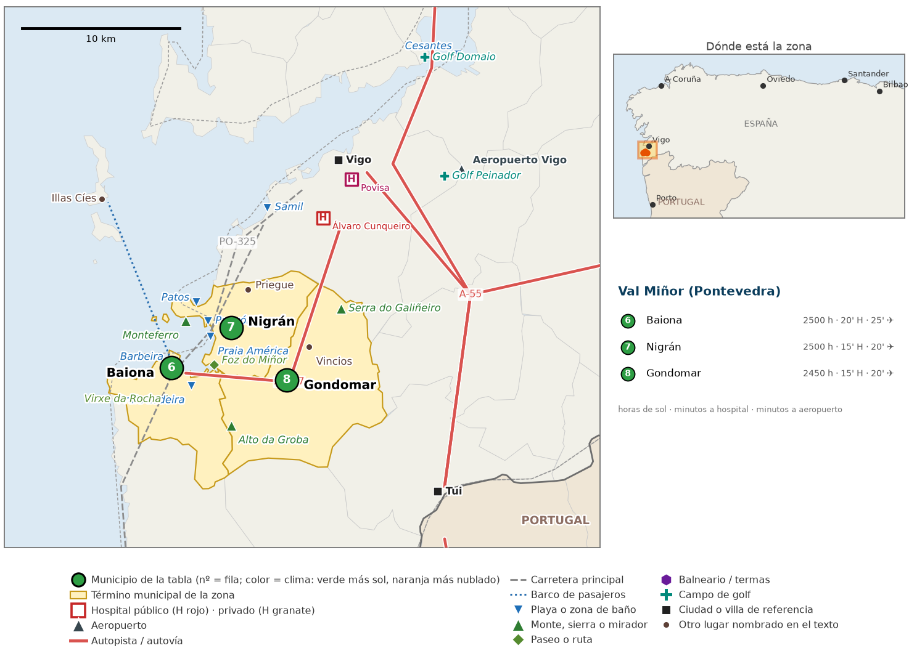

## 2. Val Miñor (Pontevedra) · Baiona, Nigrán, Gondomar

### La zona

El valle del río Miñor baja desde la Serra do Galiñeiro (711 m) y la Groba hasta la bahía de Baiona y las playas de Nigrán, con las Islas Cíes cerrando el horizonte. Tres municipios que funcionan como uno: Baiona es la villa amurallada con puerto deportivo, Parador y paseo; Nigrán es un municipio sin casco fuerte pero con playa y urbanizaciones de casas bajas (Praia América, Panxón, Patos); Gondomar es el valle interior de casas de piedra y monte (Vincios, Donas, Chaín, Morgadáns). Vigo, con su hospital y su aeropuerto, está a 15-25 minutos por la autovía AG-57 o por la carretera de la costa (PO-552).

Es la comarca más soleada de España dentro de la tabla, y la que mejor combina lo que buscas: sol, monte detrás, mar a 2-15 minutos, urbanizaciones, ciudad grande a un cuarto de hora, hospital de primera a 15-20. Su precio es literal: es cara para Galicia.

### Clima: qué notarás respecto a Mancor

| | Oct-Mar | Abr-May | Jun-Sep | Año |
|---|---|---|---|---|
| Días de lluvia al mes · **Val Miñor** | 13-15 (el peor, diciembre: 15-16) | 9-11 | 3-5 (julio: 3) | 115-118 |
| Días de lluvia al mes · Mancor | 6-8 | 4-5 | 1-3 | 55-60 |
| Horas de sol al mes · **Val Miñor** | 110-140 (diciembre: 100-105) | 210-240 | 280-310 (julio: 310, 10 h al día) | 2.450-2.500 |
| Horas de sol al mes · Mancor | 150-205 | 235-285 | 230-345 | 2.800 |
| Máxima / mínima típica · **Val Miñor** | 14 / 7 °C (enero) | 19 / 10 °C | 25-26 / 15 °C (julio) | |
| Máxima / mínima típica · Mancor | 14 / 6 °C (enero) | 22 / 11 °C | 30 / 20 °C (julio) | |

- **Sol: 2.450-2.500 h al año / 78 días despejados (110 cubiertos).** Mancor: 2.800 h / 120 despejados (60 cubiertos). Pierdes 300-350 horas, de noviembre a febrero. De junio a septiembre, 280-310 h al mes: la terraza funciona igual que ahora.
- **Lluvia: 1.400-1.500 mm en 115-118 días.** Mancor: 455-700 mm en 55-60 días. Son 60 días de lluvia más, todos entre octubre y abril: de octubre a marzo llueve 13-15 días al mes (diciembre el peor, 15-16), en abril y mayo 9-11, y de junio a septiembre 3-5 días, con julio casi seco.
- **Temperatura.** Invierno igual que Mancor (14 / 7 °C en enero, sin heladas). Verano de 20-20,5 °C de media, máxima típica de 25-26 °C en julio y noches de 15 °C; brisa de mar por la tarde.
- **Calor.** 3-8 días al año por encima de 30 °C (Mancor: 37). Gondomar, en el valle, un poco más que la costa.
- **Viento y niebla.** Viento bajo, protegido por Monteferro y la Groba. Niebla baja: algunas mañanas de niebla marina en verano en Baiona, que levanta antes del mediodía.

### Mar y baño

Aquí el mar está en casa. La bahía de Baiona y la ensenada de Nigrán están protegidas de mar abierto por Monteferro y por las Cíes, así que las playas son de arena y agua tranquila, aunque fresca (17-19 °C en agosto; en el fondo de la ría de Vigo, 18-20).

- **Praia Ladeira (Baiona · 1 km · 3 min, andando desde el centro).** Un kilómetro largo de arena fina que cierra la bahía por el sur, frente a la marisma del Miñor, con paseo detrás. Familiar, sin olas, con la fortaleza de Monterreal al fondo.
- **Barbeira (Baiona · en el pueblo, a pie).** Calita abrigada bajo las murallas de la fortaleza, dentro del casco; agua plana, muy concurrida en agosto.
- **Praia América (Nigrán · 2 km · 4 min desde Nigrán, 4 km · 7 min desde Baiona).** La playa larga de la comarca (1,4 km), con paseo, chalés y urbanizaciones detrás; arena fina, poca ola. Es la playa "de urbanización".
- **Panxón (Nigrán · 3 km · 5 min).** Villa marinera con puerto pesquero y deportivo, playa urbana y el Templo Votivo do Mar del arquitecto Antonio Palacios en lo alto. Terrazas y vida todo el año.
- **Patos (Nigrán · 4 km · 7 min desde Nigrán, 10 km · 14 min desde Gondomar).** Abierta al oeste, con las Cíes delante; es la playa de surf de la comarca, con oleaje suave y escuelas de surf.
- **Samil (Vigo · 15 km · 20 min desde Gondomar).** La playa urbana de Vigo, con paseo, jardines y piscinas.
- **Illas Cíes (barco desde Baiona en verano, 45 min de travesía).** Parque Nacional: la playa de Rodas, de arena blanca y agua transparente, y senderos hasta los faros. Se ven desde toda la comarca; es la excursión de un día de sol.

### Paseos y montaña

Es la zona con más "Tramuntana" cerca de casa: monte de verdad a diez minutos.

- **Serra do Galiñeiro (desde Vincios, Gondomar · 5 km · 8 min desde Gondomar, 8 km · 12 min desde Nigrán; hasta la cima, hora y media a pie).** Cumbres de granito de 700 m que se alzan justo detrás del valle, con vistas a la ría de Vigo, a las Cíes y, hacia el sur, al Miño y a Portugal. Hay petroglifos (grabados en la roca de hace 4.000 años) junto al camino y un área recreativa en Vincios para empezar la ruta.
- **Alto da Groba (10 km · 15 min desde Baiona).** La meseta alta de brezo donde viven los caballos salvajes, con el océano a un lado y el valle al otro (ver zona 1).
- **Monteferro (Nigrán · 5 km · 8 min desde Nigrán, 6 km · 10 min desde Baiona).** Península de pinar que separa Patos de Praia América, con un sendero circular de una hora sobre el mar, un monumento de piedra a la Marina Universal en lo alto y las Cíes enfrente. El paseo de tarde por excelencia.
- **Marisma de la Foz do Miñor (entre Nigrán y Baiona, en A Ramallosa).** Paseo llano de madera y tierra por la desembocadura del Miñor, con garzas y aves, el puente medieval de A Ramallosa y la playa de Ladeira al final. Ideal para andar a diario sin coger el coche.
- **Paseo marítimo de Baiona y la Virxe da Rocha (en el pueblo).** Desde el puerto, bordeando la fortaleza (3 km de murallas con el mar debajo), hasta la estatua de granito de 15 m de la Virxe da Rocha, a la que se puede subir por dentro; desde ahí sigue la senda litoral hacia Oia.
- **Senda fluvial del Miñor (Gondomar, en el pueblo).** Camino de ribera bajo alisos junto al río, llano, desde la villa hacia el valle.
- **Balneario de Mondariz (35 km · 35 min desde Gondomar, 45 min desde Baiona).** Gran balneario histórico de aguas termales con hotel, piscinas y circuito de agua; el sitio para los días de lluvia de invierno.
- **Golf:** Golf Peinador (Aeroclub de Vigo, junto al aeropuerto, 20 min) y Ría de Vigo Golf en Domaio (Moaña, 30 min por el puente de Rande).

### Servicios: qué hay y qué falta

- **Baiona (12.000 hab.) · 6/10.** Tiene: centro de salud, farmacias, supermercados (Gadis, Froiz, Mercadona en Sabarís), mercado semanal en Sabarís, comercio y restaurantes abiertos todo el año, puerto deportivo (Monte Real Club de Yates), colegios e instituto, biblioteca, piscina municipal. Falta: hospital, cine, gran superficie (Vigo, 20 min).
- **Nigrán (18.000 hab.) · 7/10.** Tiene: centro de salud, supermercados grandes (Mercadona, Gadis, Froiz, Lidl en A Ramallosa y Nigrán), farmacias en cada parroquia, colegios e institutos, polideportivos, puerto en Panxón, restaurantes todo el año. Falta: casco urbano con paseo comercial (los servicios están repartidos por las parroquias), hospital, cine.
- **Gondomar (15.000 hab.) · 6/10.** Tiene: una villa con plaza, mercado semanal, centro de salud, farmacias, supermercados, comercio local, bares, instituto, piscina. Falta: gran superficie, hospital, ambiente de costa (no hay mar en el pueblo).
- Ciudad de referencia: **Vigo** (297.000 hab., servicios 10/10: hospitales, El Corte Inglés, AVE, puerto, aeropuerto) a 15-25 min. Aquí la equivalencia con Inca funciona: Vigo es tu Inca grande a un cuarto de hora, y Baiona o Nigrán tu pueblo.

### Sanidad

- **Público:** Hospital Álvaro Cunqueiro (Vigo, 2015, uno de los grandes de España): 15 min desde Nigrán y Gondomar, 20 desde Baiona.
- **Privado:** Povisa (Vigo), 20-25 min. Vithas Vigo y Hospital Fátima, también en Vigo.
- Centro de salud en los tres municipios. Cumple el "deseable ≤ 30 min" con holgura; es mejor tiempo que el que tienes ahora hasta Son Espases.

### Aeropuertos y Palma

- **Vigo-Peinador:** 20 min desde Nigrán y Gondomar, 25 desde Baiona. Vuelo directo a Palma en verano (Vueling, junio-septiembre).
- **Santiago:** 80-85 min. Vuelo a Palma casi todo el año.
- **Porto:** 90-100 min. Vuelo a Palma en verano; muchos destinos.

### Precios y qué compras con 260.000 €

Nigrán 2.600 €/m², Baiona 2.500, Gondomar 1.700.

- Franja A (≤ 5 min del mar): 2 habitaciones nuevas o recientes con exterior, 211.000-220.000 € (entra). 3 habitaciones: 292.000-304.000 € (no entra en primera línea; sí en parroquias interiores de Nigrán como Priegue, Camos o Parada, a 5-10 min de la playa, por 240.000-260.000).
- Gondomar (franja B, 15 min al mar): 3 habitaciones por 160.000 €; casa de piedra con terreno 200.000-260.000.
- Obra nueva en los tres. Facilidad de venta 8-9/10, la más alta de la tabla fuera de las ciudades.

### Seguridad y ambiente

Ninguno supera 20.000 habitantes; Galicia, 35 infracciones por 1.000. Vigo, la ciudad de referencia, 39 (Palma, 88). Ambiente residencial de clase media-alta viguesa, mucho jubilado gallego y madrileño en Nigrán y Baiona, gente local en Gondomar. Tráfico: la PO-552 Baiona-Vigo se atasca en julio y agosto y en hora punta; la AG-57 desde Gondomar es fluida. Baiona pasa de 12.000 a 40.000 personas en agosto; Nigrán se llena de forma repartida; Gondomar apenas cambia.

### Parecido con Mancor / Mallorca

El más alto de la tabla en conjunto: 4/5. Gondomar es "Mancor con el mar a 15 min"; Nigrán es "una urbanización de Mallorca con el Atlántico delante"; Baiona es "Pollença con murallas". El clima es lo más mediterráneo que hay al norte del Duero, con el matiz de los 15 días de lluvia al mes en invierno.

### Lo que no tendrás

- 3 habitaciones nuevas en primera línea de Nigrán o Baiona dentro de 260.000 €.
- Tranquilidad en Baiona en julio y agosto, ni carretera de la costa sin atascos en verano.
- Vuelo a Palma todo el año a menos de 80 min.
- Invierno seco: 1.400-1.500 mm de lluvia entre octubre y abril.
- Agua de mar por encima de 19 °C.

### Municipio a municipio

#### 6 · Baiona

Villa amurallada de 12.000 habitantes. La fortaleza de Monterreal ocupa toda una península con el Parador dentro y tres kilómetros de murallas por las que se pasea sobre el mar; abajo, el casco antiguo de piedra con soportales, terrazas y la réplica de la carabela Pinta (aquí llegó en marzo de 1493 la primera noticia de América); delante, el puerto deportivo y la bahía. Tiene vida todo el año y demasiada en agosto.

- **Playas:** Ladeira (1 km · 3 min, a pie) y Barbeira (en el casco); Santa Marta y Os Frades a 3-5 min. Barco a las Cíes en verano.
- **Paseos:** murallas de la fortaleza, paseo hasta la Virxe da Rocha, senda litoral hacia Oia, Alto da Groba (15 min), marisma del Miñor.
- **Servicios 6/10:** centro de salud, farmacias, supermercados, mercado de Sabarís, puerto deportivo, comercio y restaurantes todo el año. Falta hospital, cine y gran superficie.
- **Sanidad y aeropuerto:** Álvaro Cunqueiro 20 min; Povisa 25. Vigo 25 min.
- **Precio:** 2.500 €/m². 2 habitaciones en franja A, 211.000 €; 3 habitaciones, 292.000 (fuera). Obra nueva sí.
- **Casa que encontrarás:** piso con terraza a la bahía en edificio de los 2000 con ascensor; chalé en las laderas de Baíña o Belesar con vistas. Fibra sí. Facilidad de venta 8/10, revalorización 8/10; alquiler vacacional fácil si vas a la opción de dos viviendas.
- **Para quién:** quien quiera vivir en una villa histórica con vida todo el año y acepte el lleno de verano.

#### 7 · Nigrán

18.000 habitantes repartidos en parroquias con playa y sin un centro urbano fuerte: Panxón (villa marinera), Praia América (chalés y urbanizaciones detrás de la playa larga), Patos (surf y Cíes), Nigrán (la capital administrativa, tierra adentro), Priegue y Camos (altas, con vistas al mar), Chandebrito (monte). Es el municipio-urbanización de Galicia: casas bajas, calles tranquilas, jardín, coche en la puerta y la playa a tres minutos.

- **Playas:** Praia América (2 km · 4 min), Panxón (3 km · 5 min), Patos (4 km · 7 min), Madorra. Agua 17-19 °C.
- **Paseos:** Monteferro (5 km · 8 min), marisma del Miñor, paseo de Panxón a Praia América, Galiñeiro desde Vincios (8 km · 12 min).
- **Servicios 7/10:** centro de salud, supermercados grandes, farmacias en cada parroquia, colegios, polideportivos, puerto de Panxón, restaurantes. Falta casco con paseo comercial, hospital y cine (Vigo a 15).
- **Sanidad y aeropuerto:** Álvaro Cunqueiro 15 min (el mejor tiempo de la comarca); Povisa 20. Vigo 20 min.
- **Precio:** 2.600 €/m², el más caro. 2 habitaciones en franja A, 220.000 €; 3 habitaciones en parroquias altas, 240.000-260.000.
- **Casa que encontrarás:** adosado o chalé en urbanización de los 90-2010 en Praia América, Panxón o A Ramallosa; piso con terraza en Panxón; casa con vistas en Priegue o Camos. Obra nueva sí. Fibra sí. Facilidad de venta 9/10.
- **Para quién:** quien quiera exactamente "urbanización limpia y segura con playa a pie y Vigo a 15 min" y esté dispuesto a pagar precio de Vigo.

#### 8 · Gondomar

Valle interior de 15.000 habitantes a 15 minutos del mar (franja B). La villa es pequeña, con plaza, mercado y comercio de toda la vida; alrededor, parroquias de casas de piedra en las laderas: Vincios al pie del Galiñeiro, Donas, Chaín, Morgadáns, Couso, Peitieiros, Vilaza. Monte detrás de verdad, el río Miñor en el fondo, vistas al valle y, desde las parroquias altas, al mar y a las Cíes.

- **Playas:** Patos (10 km · 14 min), Praia América (9 km · 12 min), Samil (15 km · 20 min).
- **Paseos:** Galiñeiro (5 km · 8 min; petroglifos, cumbres), senda fluvial del Miñor, ruta de los molinos de Zamáns, Mondariz a 35 min.
- **Servicios 6/10:** centro de salud, farmacias, supermercados, mercado semanal, comercio, bares, instituto, piscina. Falta gran superficie y ambiente de costa; hospital en Vigo.
- **Sanidad y aeropuerto:** Álvaro Cunqueiro 15 min por la AG-57; Povisa 20. Vigo 20 min.
- **Precio:** 1.700 €/m². 3 habitaciones, 160.000 €; casa de piedra con terreno, 200.000-260.000.
- **Casa que encontrarás:** casa de piedra rehabilitada con finca en parroquia alta, o chalé de los 2000 con vistas; piso nuevo en la villa. Fibra parcial en parroquias altas. Dependencia del coche 7/10. Verano ligeramente más cálido que la costa (20,5 °C; 5-8 días > 30 °C).
- **Para quién:** el que quiera Mancor con hospital y aeropuerto a 15 minutos y playa a 15.

### Si yo fuera tú

Aquí vendría primero, y lo haría así:

- **Primera opción: Gondomar, parroquias altas (Vincios, Donas, Morgadáns, Chaín).** Casa de piedra rehabilitada o chalé de los 2000 con terraza al sur y vistas al valle o al mar, 200.000-260.000 €. Es lo más parecido a tu calle de Mancor: casas bajas, monte detrás, silencio, vecinos de toda la vida. Con la ventaja de que el hospital y el aeropuerto están a 15 minutos (menos de lo que tardas ahora a Inca y vuelta) y la playa a 12-15. Lo que aceptaría: fibra que hay que comprobar casa por casa, coche para todo, y 5-8 días de calor en julio.
- **Segunda opción: Nigrán, Priegue o Camos.** Casa o adosado con vistas al mar en las parroquias altas, 240.000-260.000 €, con Praia América a 5-10 minutos y el Cunqueiro a 15. Es la urbanización limpia y segura que te gusta, con el Atlántico delante. Lo que aceptaría: pagar precio de Vigo y renunciar a las 3 habitaciones nuevas en primera línea.
- **Tercera opción: Baiona, solo con 2 habitaciones.** Piso con terraza a la bahía por 211.000 €, para vivir dentro de una villa histórica con paseo y puerto. Lo que aceptaría: agosto lleno y la PO-552 atascada en verano.

Qué comprobaría en la visita: en Gondomar, la fibra de la casa concreta y la orientación (los valles hacia el Galiñeiro tienen sombra pronto en invierno); en Nigrán, el ruido de la PO-552 según la parroquia y cuánta gente hay en Praia América un sábado de agosto; en Baiona, qué se oye desde la terraza en las fiestas de la Arribada (marzo) y en agosto. Y en los tres, cronometrar el trayecto al Cunqueiro un martes a las ocho de la mañana.

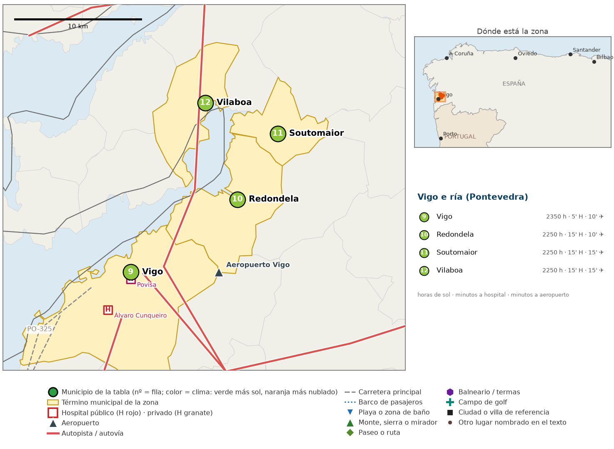

## 3. Vigo e ría (Pontevedra) · Vigo, Redondela, Soutomaior, Vilaboa

### La zona

La ciudad más grande de Galicia (297.000 hab.) y el fondo de su ría, donde el agua se calma y se templa (ensenada de San Simón, Cesantes, Arcade). Vigo es una ciudad industrial, portuaria y de cuestas, con tráfico denso, pero con dos caras que interesan: el frente de playas del suroeste (Samil, O Vao, Canido) y las parroquias costeras de Coruxo, Oia, Saiáns y Canido, que son barrios de casas bajas con vistas a las Cíes a 10 min del hospital. Redondela es una villa de 29.000 habitantes conocida por sus viaductos ferroviarios, con la playa de Cesantes y la Isla de San Simón enfrente. Soutomaior (castillo con jardines de camelias, Arcade y sus ostras) y Vilaboa (parroquias rurales sobre la ensenada, mirador de Cotorredondo) son el fondo tranquilo de la ría.

Es la zona de mejor logística de toda la tabla: hospital público y privado a 5-20 min, aeropuerto a 10-15, AP-9, tren de alta velocidad a Madrid, servicios completos.

### Clima mes a mes

| | Oct-Mar | Abr-May | Jun-Sep | Año |
|---|---|---|---|---|
| Días de lluvia al mes | 14-17 | 10-12 | 4-6 | 128-130 |
| Máxima / mínima típica | 13 / 6 °C (ene.) | 19 / 10 °C | 25-26 / 15 °C (jul.) | |
| Horas de sol al mes | 100-130 | 200-230 | 270-300 | 2.250-2.350 |

Sol: 2.350 h en Vigo, 2.250 en el fondo de la ría; 72 días despejados, 118 cubiertos. Lluvia: 1.700-1.750 mm en 128-130 días (Vigo es la ciudad grande más lluviosa de España en cantidad). Verano 20,5 °C, 3-8 días > 30 °C. Viento y niebla bajos. Comparado con Mancor: 450-550 h de sol menos y el triple de agua; frente al Val Miñor, 100-250 h menos y 10-15 días de lluvia más.

### Mar y baño

Vigo: Samil (1,7 km, urbana, paseo y jardines), O Vao (dunas, islote de Toralla), Canido, Fontaíña, Argazada; agua 17-19 °C. Redondela: Cesantes (arena, agua tranquila de ensenada, 18-20 °C, Isla de San Simón enfrente). Soutomaior: Arcade. Vilaboa: playas pequeñas de la ensenada (Deilán, Paredes). Mar abierto para pasear: Samil-O Vao, y las Cíes (ferry desde Vigo de mayo a septiembre).

### Paseos y montaña

Monte do Castro y Monte da Guía en Vigo (miradores urbanos); Monte Alba y Cepudo (Valladares, 500 m, vistas a la ría); Parque de Castrelos; senda de las Cíes (faro); Lago Castiñeiras y mirador de Cotorredondo (Vilaboa, vistas a las dos rías); Salinas de Ulló (Vilaboa, paseo llano por marisma); castillo y jardines de Soutomaior; senda del río Verdugo; Isla de San Simón (visitable). Montaña real: Galiñeiro y Aloia a 30 min.

### Servicios y ciudad de referencia

Vigo lo tiene todo (10/10): comercio, cultura, sanidad, universidad, El Corte Inglés, auditorio, estación de AVE. Redondela (7/10) es villa completa con centro de salud, mercado, comercio y estación de tren (Vigo a 10 min, Pontevedra a 15). Soutomaior (4/10) y Vilaboa (3/10) dependen de Arcade, Redondela o Pontevedra.

### Sanidad

Álvaro Cunqueiro (público) a 5-10 min desde Vigo, 20 desde Redondela; Povisa (privado-concertado) a 5-15; Vithas y Fátima en Vigo. Desde Soutomaior y Vilaboa, Montecelo (Pontevedra, público) a 15 y Quirónsalud Pontevedra a 15-20. Es la mejor sanidad de la tabla junto con Pontevedra, A Coruña, Gijón y Santander.

### Aeropuertos y Palma

Vigo-Peinador a 10 min desde Vigo y Redondela, 15 desde Soutomaior y Vilaboa (Palma en verano). Santiago (Palma casi todo el año) a 60-70 min por la AP-9. Porto a 1 h 45.

### Precios y qué compras con 260.000 €

Vigo 2.700 €/m² (el más caro de Galicia en la tabla): 2 habitaciones franja A 228.000, 3 habitaciones 316.000 (fuera); en Coruxo, Saiáns u Oia-Vigo, casa o piso con vistas a las Cíes sobrepasa el presupuesto salvo pisos de 2 habitaciones. Redondela 1.450: 3 habitaciones a 5 min de Cesantes 170.000. Soutomaior y Vilaboa 1.300: casa con terreno sobre la ría 150.000-220.000. Obra nueva en Vigo; poca en Redondela y Soutomaior; ninguna en Vilaboa.

### Seguridad y ambiente

Vigo 39 infracciones/1.000 (menos de la mitad que Palma); Redondela 29 (una de las más bajas de todos los municipios medidos en España de su tamaño). Población extranjera baja (5-7 %). Ambiente: Vigo es ciudad de trabajo y tráfico (la VG-20 y el puente de Rande en hora punta); Redondela villa obrera y ferroviaria con vida todo el año; Soutomaior y Vilaboa rurales y muy tranquilas.

### Parecido con Mancor / Mallorca

Bajo en Vigo ciudad (2/5), medio en las parroquias del suroeste de Vigo y en Vilaboa (3/5). El fondo de la ría recuerda más a la bahía de Pollença o Alcúdia (agua calma) que a la Tramuntana.

### Lo que no tendrás

- El sol del Val Miñor o el Salnés: 100-250 h menos, y 1.700 mm de lluvia.
- Pueblo tranquilo dentro de Vigo, salvo en Coruxo-Saiáns y a precio alto.
- Silencio total en Redondela: AP-9, vía del tren y puente de Rande cerca.
- Obra nueva fuera de Vigo.
- Servicios a pie en Vilaboa y Soutomaior.

### Municipio a municipio

**Vigo (nº 9).** Solo tiene sentido para ti en su costa suroeste: las parroquias de Coruxo, Oia, Saiáns y Canido (casas bajas, huertas, vistas a las Cíes, playas de O Vao, Canido y Fontaíña, a 10 min del hospital y de Samil), o en Alcabre-Samil si quieres paseo marítimo a pie. El resto es ciudad densa de cuestas. Servicios 10/10, hospital 5-10, aeropuerto 10, AVE, tren a Porto. Precio 2.700; 2 habitaciones franja A 228.000; casa en Coruxo/Saiáns con vistas suele superar 300.000. Dependencia del coche 2/10 en la ciudad, 5/10 en las parroquias. Seguridad 39/1.000. Para quién: quien quiera ciudad completa y esté dispuesto a pagar por vistas; en tu caso, solo en las parroquias del suroeste.

**Redondela (nº 10).** Villa de 29.000 habitantes al fondo de la ría, con dos viaductos ferroviarios del siglo XIX, casco con vida, mercado, estación de tren (Vigo 10 min, Pontevedra 15) y salida de la AP-9. Playa de Cesantes (agua tranquila de 18-20 °C, Isla de San Simón enfrente) a 5 min; Chapela linda con Vigo. Paseos: paseo de Cesantes, senda del río Alvedosa, Isla de San Simón, monte Penide (mámoas). Servicios 7/10, comunicaciones 8/10. Hospital 15-20. Aeropuerto 10. Precio 1.450 €/m²: 3 habitaciones franja A 170.000. Fibra sí; poca obra nueva. Seguridad 29/1.000 (mejor que Inca). Ruidos: tren y autopista según la zona. Para quién: quien priorice logística y precio sobre postal: es el municipio más "práctico" de toda la tabla.

**Soutomaior (nº 11).** 7.500 habitantes, dos núcleos: Soutomaior (castillo medieval con parque de camelias y bosque) y Arcade (villa de la ría, ostras, Festa da Ostra en abril, playa). Río Verdugo con senda. Franja B (8 min al mar: Arcade/Cesantes). Servicios 4/10 (centro de salud, farmacias, lo básico en Arcade). Hospital Montecelo 15; Povisa 25. Aeropuerto 15. Precio 1.300 €/m²: casa de piedra con terreno 120.000-200.000. Fibra parcial; poca obra nueva. Para quién: quien quiera pueblo tranquilo con castillo, ostras y agua calma, a 15 min de dos ciudades.

**Vilaboa (nº 12).** 6.000 habitantes en parroquias rurales sobre la ensenada de San Simón: Salinas de Ulló (marisma con paseo), playas pequeñas de la ensenada, Lago Castiñeiras y el mirador de Cotorredondo (vistas a las rías de Vigo y Pontevedra). Servicios 3/10; dependencia del coche 8/10. Hospital Montecelo 15. Aeropuerto 15. Precio 1.300; casa con terreno y vistas a la ría 130.000-200.000. Sin obra nueva; fibra parcial. Para quién: quien quiera vivir en una parroquia gallega auténtica mirando al agua calma, a 15 min de Pontevedra y del hospital, y comprar mucho por poco.

### Si yo fuera tú

Redondela como opción práctica (hospital, aeropuerto, tren, agua templada y 3 habitaciones por 170.000), o Vigo-Coruxo si quieres pagar por las Cíes delante. No es la zona más bonita, pero es la que menos coche exige.

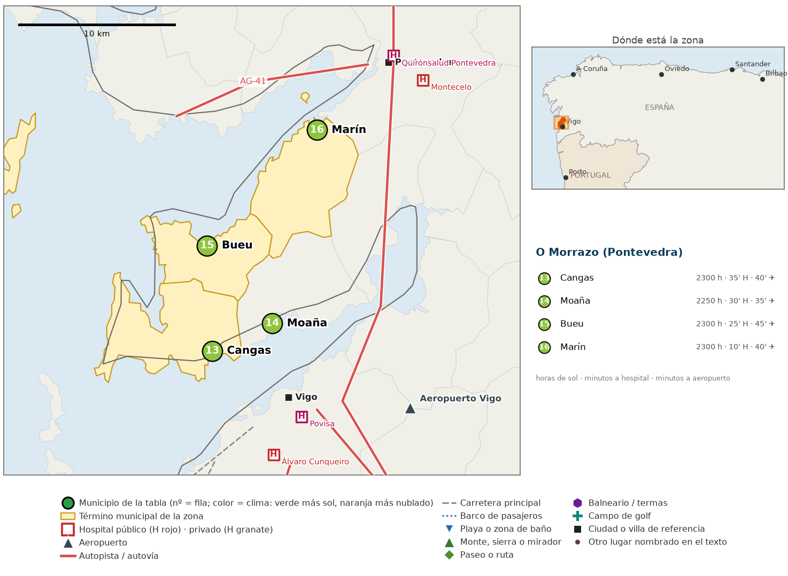

## 4. O Morrazo (Pontevedra) · Cangas, Moaña, Bueu, Marín

### La zona

La península que separa las rías de Vigo y Pontevedra. Su lado sur (Moaña, Cangas) mira a Vigo al otro lado del agua, con barcos de pasajeros cada media hora; su lado norte (Bueu, Marín) mira a la ría de Pontevedra y a la isla de Ons; su punta oeste es la Costa da Vela: Cabo Home, sus tres faros, la playa de Barra y el Monte Facho de Donón sobre el Atlántico. Villas marineras con vida propia (Cangas 26.000 hab., Marín 24.000, Moaña 19.000, Bueu 12.000) y parroquias altas con vistas a las dos rías (Aldán, Hío, Domaio, Cela).

Es una zona de mar antes que de monte: playas para todos los gustos, agua de ría templada, senderos costeros. Su problema logístico es el puente de Rande: todo pasa por él para ir a Vigo, y a Pontevedra se va por la costa.

### Clima mes a mes

| | Oct-Mar | Abr-May | Jun-Sep | Año |
|---|---|---|---|---|
| Días de lluvia al mes | 14-16 | 10-12 | 3-5 | 125-128 |
| Máxima / mínima típica | 13 / 6 °C (ene.) | 19 / 10 °C | 25 / 15 °C (jul.) | |
| Horas de sol al mes | 100-130 | 200-230 | 270-300 | 2.250-2.300 |

Sol: 2.250-2.300 h, 72 días despejados, 120 cubiertos. Lluvia 1.500-1.550 mm en 125-128 días. Verano 20 °C, 3-6 días > 30 °C. Viento bajo (medio en la Costa da Vela), niebla baja. Comparado con Mancor: 500 h menos de sol, dos veces los días de lluvia; frente al Val Miñor, 200 h menos.

### Mar y baño

Cangas: Rodeira (urbana), Areamilla, Liméns, Nerga, Viñó, Barra (naturista, dunas), Melide (Cabo Home), Menduíña y Areacova en la ría de Aldán (agua muy tranquila). Moaña: A Xunqueira y O Con (urbanas, ría, 18-20 °C). Bueu: Lapamán (con Marín), Beluso, Area de Bon, Portomaior. Marín: Portocelo, Mogor (petroglifos), Aguete, Loira. Ons enfrente (ferry desde Bueu en verano). Agua 17-19 °C en las playas abiertas, 18-20 en la ría.

### Paseos y montaña

Costa da Vela: sendero de Cabo Home a Donón y al Monte Facho (castro, vistas a las Cíes a 3 km); Cabo Udra (Bueu, senda circular sobre el mar); Monte Faro de Domaio (Moaña, 624 m, mirador de la ría de Vigo); Lago Castiñeiras y Cotorredondo (Marín-Vilaboa); paseo marítimo de Cangas y de Moaña; ruta de los molinos de Aldán; senda del río Lameira. Golf en Domaio (Ría de Vigo Golf). Es la zona con mejor senderismo costero de las Rías Baixas.

### Servicios y ciudad de referencia

Cangas (7/10) y Marín (7/10) son villas completas: centro de salud con urgencias, comercio, mercado, cines pequeños, restaurantes. Moaña (6/10) y Bueu (5/10) tienen todo lo básico. Ciudad de referencia: Pontevedra a 10-15 min desde Marín, 25-35 desde Bueu y Cangas; Vigo en barco (20 min desde Cangas y Moaña, sin coche) o por Rande (25-35 min con tráfico).

### Sanidad

Marín: Montecelo (público) a 10-15 min y Quirónsalud Pontevedra a 10. Moaña: 30 min a Pontevedra o Vigo. Bueu: 25-30. Cangas: 35 min a Montecelo o a Álvaro Cunqueiro por Rande. Centros de salud en los cuatro. Solo Marín cumple el deseable de 30.

### Aeropuertos y Palma

Vigo-Peinador a 35-45 min (Palma en verano). Santiago (Palma casi todo el año) a 55-70.

### Precios y qué compras con 260.000 €

Cangas 1.750 €/m², Moaña 1.600, Bueu y Marín 1.500. En franja A, 3 habitaciones: Cangas 205.000, Moaña 187.000, Bueu y Marín 176.000. Casa en Aldán o Hío con vistas a la ría: 180.000-260.000. Obra nueva en Cangas; poca en el resto. Fibra en los cuatro.

### Seguridad y ambiente

Marín 31/1.000, Cangas 37 (ambos por debajo de Inca); Moaña y Bueu no medidos. Ambiente: villas marineras de trabajo (pesca, conserva, astilleros, Escuela Naval en Marín), mucho veraneante vigués y madrileño en Cangas en agosto. Tráfico: el puente de Rande y la salida de Cangas en hora punta.

### Parecido con Mancor / Mallorca

Medio: 3/5. Aldán e Hío (Cangas) son parroquias de casas bajas con vistas al mar y monte detrás que recuerdan a la costa de Andratx; el resto son villas portuarias.

### Lo que no tendrás

- Hospital a menos de 25-35 min desde Cangas, Moaña y Bueu.
- Aeropuerto a menos de 35-45 min.
- Ciudad a 5 min (Pontevedra a 15-35; Vigo solo en barco).
- Puente de Rande sin atasco en hora punta.
- Silencio en Marín (puerto comercial y Escuela Naval).
- Obra nueva fuera de Cangas.

### Municipio a municipio

**Cangas (nº 13).** 26.000 habitantes: la villa (puerto, paseo, mercado, barco a Vigo cada 30 min) y las parroquias de Aldán (ría propia, agua calma, casas de piedra), O Hío (cruceiro barroco, Monte Facho, Nerga, Barra) y Darbo. Playas a 1-2 min. Paseos: Costa da Vela, Cabo Home, Facho, molinos de Aldán. Servicios 7/10. Hospital 35 (su debilidad). Aeropuerto 40. Precio 1.750; 3 habitaciones franja A 205.000; obra nueva sí. Facilidad de venta 8/10. Seguridad 37. Para quién: quien quiera el mejor mar y los mejores senderos costeros de la zona y acepte el hospital a 35.

**Moaña (nº 14).** 19.000 habitantes frente a Vigo, con barco a la ciudad en 20 min y el puente de Rande a 5. Playas urbanas de ría (A Xunqueira, O Con) a 2-3 min; Domaio (golf, Monte Faro) en el extremo este. Servicios 6/10, comunicaciones 7/10. Hospital 30. Aeropuerto 35. Precio 1.600; 3 habitaciones 187.000. Fibra sí; poca obra nueva. Para quién: quien trabaje o viva de cara a Vigo sin vivir en Vigo.

**Bueu (nº 15).** 12.000 habitantes, la villa más tranquila del Morrazo, con puerto, Museo Massó, la isla de Ons enfrente (ferry en verano) y Cabo Udra al lado. Playas: Lapamán, Beluso, Area de Bon a 1-5 min. Servicios 5/10. Hospital Quirónsalud Pontevedra 25, Montecelo 30. Aeropuerto 45. Precio 1.500; 3 habitaciones 176.000. Para quién: quien quiera calma, mar y Ons, con Pontevedra a 25.

**Marín (nº 16).** 24.000 habitantes a 10 min de Pontevedra: puerto comercial (contenedores, ruido), Escuela Naval Militar, casco urbano compacto, y hacia el oeste las playas de Portocelo, Mogor (petroglifos) y Aguete con urbanizaciones de chalés. Paseos: Lago Castiñeiras, senda litoral Marín-Aguete. Servicios 7/10. Hospital Montecelo 10-15 y Quirónsalud 10: la mejor sanidad de la zona. Aeropuerto 40. Precio 1.500; 3 habitaciones 176.000. Seguridad 31. Para quién: quien quiera hospital y Pontevedra a 10 min y playas de ría a 5, y no le importe el puerto.

### Si yo fuera tú

Cangas (Aldán, Hío) si mar y senderos pesan más que el hospital a 35; Marín (Aguete, Mogor) si manda el hospital y Pontevedra a 10 min. Bueu si quieres el silencio.

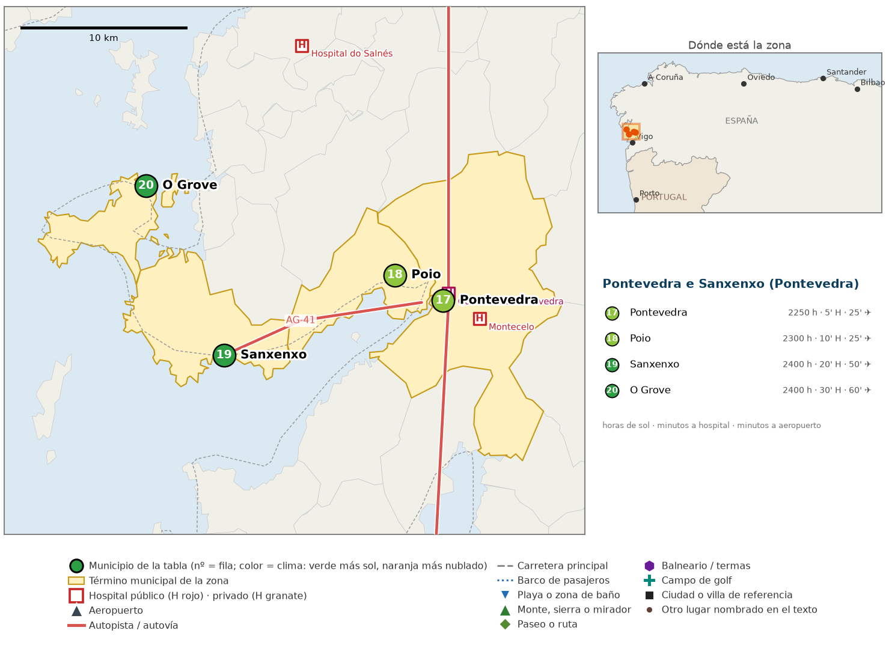

## 5. Pontevedra e Sanxenxo (Pontevedra) · Pontevedra, Poio, Sanxenxo, O Grove

### La zona

La capital de provincia (84.000 hab.), la ciudad peatonal de referencia en Europa, y la orilla norte de su ría hacia el Atlántico: Poio (Combarro, Raxó, Samieira, Lourido), Sanxenxo (Silgar, Portonovo, la Lanzada) y la península de O Grove (A Toxa, marisco, la Lanzada). Detrás, el Monte Castrove (613 m) y la sierra baja del Salnés.

Pontevedra es la ciudad que mejor funciona para un jubilado en Galicia: centro histórico de piedra entero peatonal, sin tráfico, limpio, con hospital público y privado en 5 min, tren, y el mar a 12 min. Poio es su pueblo de piedra sobre la ría; Sanxenxo es el gran veraneo gallego (17.000 habitantes en invierno, más de 100.000 en agosto); O Grove es el marisco y el balneario.

### Clima mes a mes

| | Oct-Mar | Abr-May | Jun-Sep | Año |
|---|---|---|---|---|
| Días de lluvia al mes | 13-16 | 9-12 | 3-5 | 115-130 |
| Máxima / mínima típica | 13 / 5 °C (ene.) | 20 / 9 °C | 26 / 15 °C (jul.) | |
| Horas de sol al mes | 100-140 | 200-240 | 270-310 | 2.250-2.400 |

Sanxenxo y O Grove: 2.400 h, 115-118 días de lluvia, 1.250-1.300 mm (con el Salnés, el rincón más seco de Galicia). Pontevedra y Poio: 2.250-2.300 h, 125-130 días, 1.500-1.600 mm. 70-72 días despejados, 120 cubiertos. Verano 19,5-20,5 °C, 3-8 días > 30 °C (Pontevedra ciudad, algo más: 8-10). Viento medio en Sanxenxo y O Grove (brisa atlántica), bajo en Pontevedra y Poio. Niebla baja. Comparado con Mancor: 400-550 h de sol menos; en invierno, mínimas algo más bajas en Pontevedra (5 °C).

### Mar y baño

Poio: Lourido, Raxó, Cabeceira, Chancelas (ría, arena, 18-20 °C, agua calma). Sanxenxo: Silgar (urbana, paseo), Areas, Montalvo, Major, Canelas, Paxariñas, Portonovo (Baltar, Caneliñas); la Lanzada (2,5 km, dunas, atlántica, con O Grove). O Grove: A Lanzada, Area da Cruz, Mexilloeira, Con Negro, Raeiros, Area Grande, Pipas (tranquilas, ría de Arousa). Pontevedra: 12 min a Lourido o Portocelo (Marín). Puerto deportivo en Sanxenxo (uno de los mayores de Galicia).

### Paseos y montaña

Pontevedra: casco histórico, Alameda, senda del río Lérez (Illa das Esculturas), paseo a Marín por la ría (Os Praceres). Poio: senda litoral Pontevedra-Combarro (7 km llanos por la orilla), Monte Castrove (mirador sobre las rías de Pontevedra y Arousa), monasterio de Poio. Sanxenxo: paseo Silgar-Portonovo, ruta de los miradores de A Lanzada, Punta Faxilda. O Grove: Monte Siradella (mirador 167 m), ruta circular de la península (hasta 20 km), A Toxa (isla, paseo del pinar), A Lanzada (ermita, castro, dunas), Con Negro. Balnearios: A Toxa (5 min desde O Grove), Caldas de Reis y Cuntis (20-30 min desde Pontevedra).

### Servicios y ciudad de referencia

Pontevedra 10/10: todo, a pie. Poio 7/10 (centro de salud, supermercados, farmacias, comercio en la villa de Poio y Combarro; Pontevedra a 5-10). Sanxenxo 6/10 todo el año (con vida en invierno, aunque menos comercio abierto que en verano). O Grove 6/10 (villa marinera activa todo el año, con Festa do Marisco en octubre). Pontevedra es tu Inca a 5-10 min desde Poio, a 20-25 desde Sanxenxo, a 35 desde O Grove.

### Sanidad

Montecelo (público, complejo hospitalario de Pontevedra) y Quirónsalud Miguel Domínguez (privado): 5 min desde Pontevedra, 10 desde Poio, 20-25 desde Sanxenxo. O Grove: Hospital do Salnés (Vilagarcía, público) a 30, Quirónsalud a 45. Centros de salud en los cuatro. Pontevedra y Poio, sanidad de primera; Sanxenxo aceptable; O Grove justo en el límite deseable.

### Aeropuertos y Palma

Vigo-Peinador a 25 min desde Pontevedra y Poio por la AP-9 (Palma en verano), 50 desde Sanxenxo, 60 desde O Grove. Santiago (Palma casi todo el año) a 50-60 min desde los cuatro.

### Precios y qué compras con 260.000 €

Pontevedra y Poio 1.900 €/m²: en Poio, 2 habitaciones franja A 161.000, 3 habitaciones 222.000 (entra con margen), casa en Raxó o Samieira con vistas 220.000-280.000; en Pontevedra (franja B) 3 habitaciones 180.000. Sanxenxo 2.900 (el más caro de la tabla): 2 habitaciones franja A 245.000 (entra justo), 3 habitaciones 339.000 (no). O Grove 2.300: 2 habitaciones 194.000, 3 habitaciones 269.000 (no en primera línea; sí a 5-10 min). Obra nueva en Pontevedra, Poio y Sanxenxo; poca en O Grove. Fibra en los cuatro.

### Seguridad y ambiente

Pontevedra 39/1.000 (ciudad muy segura para su tamaño; la peatonalización redujo accidentes a casi cero). Poio, Sanxenxo y O Grove no medidos; Galicia 35. Ambiente: Pontevedra es ciudad culta, limpia y de paseo; Poio es pueblo de ría con muchos pontevedreses que viven allí; Sanxenxo es residencial-turístico de nivel alto (Madrid, Galicia) con gran presión en julio-agosto; O Grove es villa marinera con turismo de marisco y balneario.

### Parecido con Mancor / Mallorca

Poio 4/5: pueblo de piedra a 5 min de una ciudad pequeña y buena, con el agua delante y el Castrove detrás. Sanxenxo 2/5 (es más "Port d'Alcúdia"). O Grove 3/5 (villa marinera). Pontevedra ciudad 3/5 como "Inca ideal", pero es ciudad.

### Lo que no tendrás

- Tranquilidad en Sanxenxo de julio a septiembre, ni 3 habitaciones allí en presupuesto.
- Hospital a menos de 30 min desde O Grove, ni aeropuerto a menos de 60.
- Montaña alta: el Castrove es un monte suave; la sierra está a 45 min.
- Menos de 125-130 días de lluvia en Pontevedra y Poio (Sanxenxo y O Grove, 115-118).
- Vuelo a Palma en verano a menos de 50 min desde Sanxenxo y O Grove.

### Municipio a municipio

**Pontevedra (nº 17).** 84.000 habitantes; casco histórico completo de granito, plazas con soportales (Ferrería, Verdura, Leña), Santuario de la Peregrina, Alameda, río Lérez con isla de esculturas. Todo peatonal desde 1999: se vive sin coche (dependencia 2/10). Servicios 10/10. Hospital 5. Aeropuerto Vigo 25; Santiago 50. Tren a Vigo (25 min), Santiago (40) y Madrid (Alvia). Mar: Lourido (Poio) a 12 min (franja B). Precio 1.900; 3 habitaciones 180.000; obra nueva sí. Seguridad 39. Para quién: quien quiera vivir en ciudad pequeña, culta y peatonal con el mar a 12 min y todo lo demás a pie. Para ti, la ciudad de referencia; para vivir, mejor Poio.

**Poio (nº 18).** 17.000 habitantes en la orilla norte de la ría, pegado a Pontevedra por el puente: Combarro (hórreos sobre el agua, calles de piedra, muy visitado en verano pero pueblo de verdad), Raxó y Samieira (parroquias marineras en ladera con vistas a la ría y a Marín), Lourido y Cabeceira (playas), San Xoán (la villa, servicios), monasterio de Poio, Monte Castrove detrás. Franja A (5 min al mar). Servicios 7/10. Hospital 10 (público y privado). Aeropuerto 25. Precio 1.900; 2 habitaciones franja A 161.000, 3 habitaciones 222.000; obra nueva sí; fibra sí. Facilidad de venta 8/10. Para quién: el que quiera exactamente "pueblo de piedra sobre el agua a 5 minutos de una Inca mejor que Inca".

**Sanxenxo (nº 19).** 17.000 habitantes en invierno, más de 100.000 en agosto: paseo de Silgar, puerto deportivo, Portonovo (pueblo pesquero con vida propia), decenas de playas de arena blanca, la Lanzada. Clima: 2.400 h, 118 días de lluvia, viento medio. Servicios 6/10 todo el año (buenos, pero muy dimensionados para el verano). Hospital 20-25. Aeropuerto Vigo 50, Santiago 55. Precio 2.900: 2 habitaciones franja A 245.000; 3 habitaciones fuera; obra nueva abundante. Facilidad de venta 9/10 (la más alta), revalorización 7/10: es la mejor plaza de la tabla para alquiler vacacional. Para quién: quien priorice sol y facilidad de venta/alquiler y acepte pagar y compartir el verano con Madrid.

**O Grove (nº 20).** 10.000 habitantes en una península de marisco: puerto, isla de A Toxa (balneario, Gran Hotel, golf de 9 hoyos, capilla de conchas), la Lanzada, Monte Siradella, playas tranquilas de la ría de Arousa (Area da Cruz, Mexilloeira, Raeiros), San Vicente do Mar (chalés). Clima: 2.400 h, 115 días de lluvia, 1.250 mm (el más seco de la tabla en Galicia junto a Ribeira), viento medio. Servicios 6/10. Hospital 30 (Salnés). Aeropuerto Vigo/Santiago 60. Precio 2.300: 2 habitaciones franja A 194.000. Poca obra nueva. Dependencia del coche 6/10. Para quién: quien quiera marisco, balneario y la ría de Arousa cada día, y acepte hospital a 30 y aeropuerto a 60.

### Si yo fuera tú

Poio (Raxó, Samieira, Combarro) es mi segunda opción de toda la tabla, y quizá la primera si pesa la ciudad a 5 minutos: pueblo de piedra, agua delante, monte detrás, hospital público y privado a 10, Pontevedra a 5-10, aeropuerto a 25, y 3 habitaciones nuevas dentro del presupuesto.

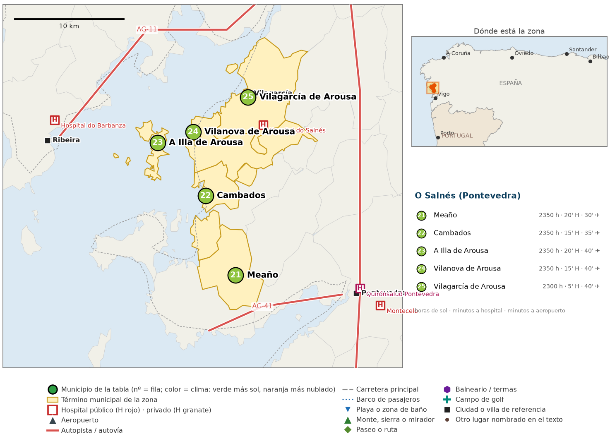

## 6. O Salnés (Pontevedra) · Meaño, Cambados, A Illa de Arousa, Vilanova de Arousa, Vilagarcía de Arousa

### La zona

La comarca del Albariño: un valle amplio y suave entre el Monte Castrove y el Xiabre, cubierto de viñedo en pérgola, con pazos de piedra, y abierto a la ría de Arousa, la más grande y calmada de Galicia (bateas de mejillón, islas de Arousa y Cortegada, agua templada). Cambados es la capital del vino y una de las villas más nobles de Galicia (plaza de Fefiñáns); Vilagarcía (37.000 hab.) es la ciudad de servicios, con puerto, estación de tren y hospital comarcal; A Illa de Arousa es una isla unida por un puente de 2 km, con el parque natural de Carreirón; Meaño y Vilanova son parroquias de viñedo y ría.

Es la zona más "mediterránea" de Galicia en paisaje agrícola (viña, piedra, pazos) y la ría más seca. Le falta una ciudad buena a cinco minutos: Vilagarcía es útil pero es una ciudad portuaria sin encanto; Pontevedra está a 25-30 min; Santiago a 45.

### Clima mes a mes

| | Oct-Mar | Abr-May | Jun-Sep | Año |
|---|---|---|---|---|
| Días de lluvia al mes | 13-15 | 9-11 | 3-5 | 118-122 |
| Máxima / mínima típica | 13 / 5 °C (ene.) | 20 / 9 °C | 25-26 / 14 °C (jul.) | |
| Horas de sol al mes | 100-140 | 200-240 | 270-300 | 2.300-2.350 |

Sol 2.300-2.350 h, 70 días despejados, 120 cubiertos. Lluvia 1.350-1.450 mm en 118-122 días: la ría más seca con O Grove y Ribeira. Verano 19,5 °C, 3-8 días > 30 °C. Viento medio en A Illa y Vilanova (abiertos a la ría), bajo en Meaño, Cambados y Vilagarcía. Niebla baja. Comparado con Mancor: 450-500 h de sol menos; invierno con mínimas de 5 °C (heladas ocasionales en el valle de Meaño).

### Mar y baño

Todo es ría de Arousa, agua calma y templada (18-20 °C): Cambados (A Mouta, Fefiñáns), A Illa (O Bao, la más larga; Area da Secada; las calas de Carreirón), Vilanova (As Sinas, A Braña, O Terrón), Vilagarcía (Compostela y A Concha, urbanas, con paseo). Mar abierto y grandes playas atlánticas: A Lanzada a 10 min desde Meaño, 20 desde Cambados. Ideal para el baño de 30 minutos que pides; menos para el paseo por mar abierto, que hay que ir a buscar a A Lanzada o a Corrubedo.

### Paseos y montaña

Parque Natural de Carreirón (A Illa, senda llana entre pinos y calas); paseo marítimo de Cambados y mirador de A Pastora; ruta del Umia (senda fluvial); Monte Lobeira (Vilanova-Vilagarcía, mirador de la ría); Monte Xiabre (Vilagarcía, 641 m); Monte Castrove (Meaño-Poio); Carril e Illa de Cortegada (Vilagarcía, parque nacional, visitas guiadas); ruta de los pazos y bodegas (Rías Baixas). Balnearios: A Toxa a 15-20 min, Caldas de Reis y Cuntis a 20-30. Montaña real: no; lomas y montes de 400-650 m.

### Servicios y ciudad de referencia

Vilagarcía 8/10 (hospital, tren, comercio, centros comerciales pequeños, puerto, restaurantes). Cambados 6/10 (centro de salud, comercio, mercado, restaurantes de nivel, bodegas). Vilanova 5/10 y A Illa 4/10 (lo básico). Meaño 3/10 (Dena tiene farmacia, supermercado, bares, centro de salud; el resto en Sanxenxo, Cambados o Vilagarcía). Ciudad de calidad: Pontevedra a 25-30 min; Santiago a 45.

### Sanidad

Hospital do Salnés (Vilagarcía, público, comarcal): 5 min desde Vilagarcía, 15 desde Cambados y Vilanova, 20 desde Meaño y A Illa. Quirónsalud Pontevedra (privado): 20 desde Meaño, 25 desde Cambados, 30-35 desde el resto. Montecelo (Pontevedra) a 25-35 para lo que el comarcal no cubre. Cumple el deseable de 30 en todos.

### Aeropuertos y Palma

Santiago-Lavacolla (vuelo a Palma casi todo el año) a 45-55 min por la AP-9: el mejor acceso a Palma de todas las Rías Baixas junto con el Barbanza. Vigo a 30-40 (Palma en verano).

### Precios y qué compras con 260.000 €

Meaño y Vilanova 1.350 €/m² (3 habitaciones franja A 158.000; casa de piedra con viñedo 150.000-230.000), Cambados 1.500 (3 habitaciones 176.000), Vilagarcía 1.700 (199.000), A Illa 1.900 (222.000). Obra nueva en Vilagarcía; poca en Cambados, A Illa y Vilanova; ninguna en Meaño. Fibra en todos menos Meaño (parcial). Es la zona donde con 260.000 € compras casa de piedra con terreno y vistas a la ría sin llegar al límite, y donde la opción de dos viviendas es realista.

### Seguridad y ambiente

Vilagarcía 48/1.000 (la más alta medida en la provincia; ciudad portuaria con historia de narcotráfico en los 80-90, hoy normalizada pero con más incidencia que sus vecinas). Cambados, Meaño, A Illa y Vilanova no medidos; Galicia 35. Ambiente: rural-vitícola, gente local, muy tranquilo en invierno; Cambados y A Illa se llenan en agosto (Festa do Albariño a primeros de agosto es multitudinaria).

### Parecido con Mancor / Mallorca

Meaño 3/5 (viñedo, piedra, casas bajas: es el "Binissalem con ría"); Cambados 3/5 (villa señorial de piedra con paseo marítimo); A Illa y Vilanova 2/5; Vilagarcía 2/5. Le falta el monte detrás.

### Lo que no tendrás

- Ciudad buena a 5 min: Vilagarcía sirve, Pontevedra está a 25-30.
- Montaña detrás del pueblo.
- Obra nueva fuera de Vilagarcía.
- Servicios a pie en Meaño (3/10) y A Illa (4/10).
- Vuelo a Palma en verano a menos de 30-40 min.
- Mar abierto para pasear a menos de 10-20 min (todo es ría).

### Municipio a municipio

**Meaño (nº 21).** 5.000 habitantes entre viñedos, con Dena como núcleo (junto a Sanxenxo) y parroquias de piedra en las laderas del Castrove (Xil, Padrenda, Simes, Cobas). Franja A por Dena (5 min a la ría); A Lanzada a 10. Servicios 3/10; dependencia del coche 9/10 (la más alta de la tabla). Hospital Salnés 20, Quirónsalud 20. Aeropuerto Vigo 30, Santiago 55. Precio 1.350; casa de piedra con viñedo 150.000-230.000. Sin obra nueva; fibra parcial. Para quién: quien quiera vivir entre viñedo y piedra como en el Raiguer, con Sanxenxo y Cambados a 10 min, y no le importe coger el coche para todo.

**Cambados (nº 22).** 14.000 habitantes; capital del Albariño; plaza de Fefiñáns (pazo, iglesia, arco), ruinas de Santa Mariña Dozo, torre de San Sadurniño, paseo marítimo, barrio marinero de Santo Tomé, bodegas y pazos, restaurantes de nivel. Playas de ría a 2-3 min. Paseos: paseo marítimo, A Pastora, ruta del Umia. Servicios 6/10. Hospital 15. Aeropuerto Santiago 50. Precio 1.500; 3 habitaciones franja A 176.000. Poca obra nueva; fibra sí. Facilidad de venta 7/10, revalorización 7/10. Para quién: quien quiera vivir en una villa noble de piedra con vida todo el año, vino, marisco y la ría delante. Mi elección en la zona.

**A Illa de Arousa (nº 23).** 5.000 habitantes en una isla de 7 km unida por puente; 36 km de costa con playas y calas; parque natural de Carreirón; faro de Punta Cabalo; puerto y conserveras. Viento medio, agua muy templada. Servicios 4/10. Hospital 20. Aeropuerto 40-50. Precio 1.900 (el más alto de la zona por la escasez): 3 habitaciones 222.000. Poca obra nueva; fibra sí. Para quién: quien quiera isla, agua calma y calas a pie, y acepte un invierno muy tranquilo y un agosto lleno.

**Vilanova de Arousa (nº 24).** 10.000 habitantes; villa natal de Valle-Inclán (casa-museo), playas de ría (As Sinas, A Braña), puerto de O Terrón, parroquias de viñedo (Caleiro, Baión). Servicios 5/10. Hospital 15. Aeropuerto 40-50. Precio 1.350; 3 habitaciones franja A 158.000. Poca obra nueva. Para quién: quien quiera la ría de Arousa al mejor precio, entre Cambados y Vilagarcía.

**Vilagarcía de Arousa (nº 25).** 37.000 habitantes; puerto comercial, estación de tren (Santiago 25 min, Alvia a Madrid), playas urbanas de ría con paseo (Compostela, A Concha), Carril (almejas, Cortegada), Monte Lobeira y Xiabre. Servicios 8/10, comunicaciones 8/10. Hospital do Salnés a 5. Aeropuerto Santiago 40-45 (el más rápido a Palma de Pontevedra). Precio 1.700; 3 habitaciones franja A 199.000; obra nueva sí. Seguridad 48/1.000. Dependencia del coche 3/10. Para quién: quien quiera servicios y tren a pie y acepte ciudad portuaria sin encanto y con peor seguridad que las vecinas.

### Si yo fuera tú

Cambados, o una casa de piedra en las laderas de Meaño con vistas a la ría. Compras holgado, tienes hospital a 15-20, Santiago (Palma casi todo el año) a 50, la ría más seca y templada de Galicia, y un paisaje de viña y piedra. Sabiendo que la ciudad buena está a 25 min y no a 5, y que no hay sierra detrás.

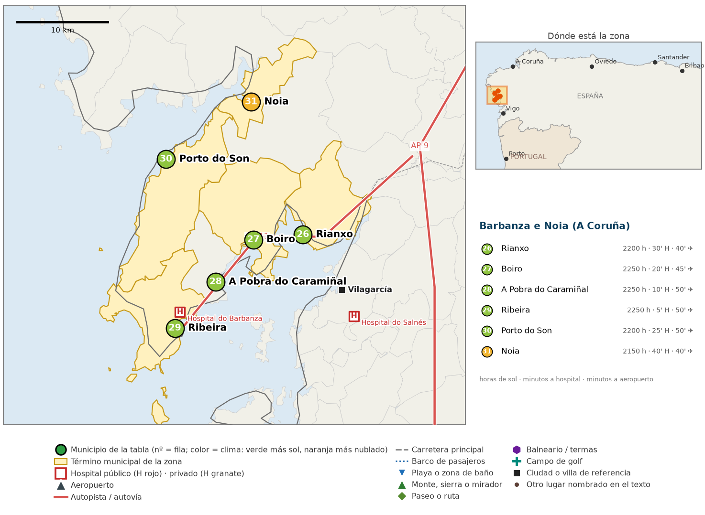

## 7. Barbanza e Noia (A Coruña) · Rianxo, Boiro, A Pobra do Caramiñal, Ribeira, Porto do Son, Noia

### La zona

La orilla norte de la ría de Arousa y la ría de Muros e Noia, con la Serra do Barbanza (600 m) levantada a la espalda de todos los pueblos: una sierra de granito con dólmenes, castros, piscinas naturales de río y el mirador de A Curota, desde donde se ven las cuatro rías. Rianxo, Boiro y A Pobra miran a la ría de Arousa (agua calma, 18-20 °C); Ribeira es el gran puerto pesquero y tiene el hospital comarcal, las dunas de Corrubedo y el dolmen de Axeitos; Porto do Son ya es Atlántico abierto (castro de Baroña sobre el mar); Noia es la villa histórica al fondo de la otra ría.

Es la zona que mejor reproduce "monte detrás, mar delante" al precio más bajo de las Rías Baixas. Le falta ciudad (Santiago a 40-50 min) y hospital privado cerca.

### Clima mes a mes

| | Oct-Mar | Abr-May | Jun-Sep | Año |
|---|---|---|---|---|
| Días de lluvia al mes | 13-16 | 10-12 | 3-6 | 118-128 |
| Máxima / mínima típica | 13 / 6 °C (ene.) | 19 / 10 °C | 24-25 / 14 °C (jul.) | |
| Horas de sol al mes | 95-130 | 190-230 | 260-290 | 2.150-2.250 |

Sol 2.150-2.250 h, 65 días despejados, 125 cubiertos. Lluvia 1.250-1.500 mm en 118-128 días (Ribeira, 1.250, entre los más secos de la tabla). Verano 19,5 °C, 2-6 días > 30 °C. Viento medio en Ribeira, A Pobra y Porto do Son; niebla media en Porto do Son y Noia. Comparado con Mancor: 550-650 h de sol menos; menos sol que el Salnés de enfrente por la sombra de la sierra en las tardes de invierno.

### Mar y baño

Ría de Arousa: Tanxil y A Torre (Rianxo), Barraña, Carragueiros y Mañóns (Boiro), Cabío, A Corna y Lombiña (A Pobra), Coroso, Río Azor y Aguiño (Ribeira). Atlántico abierto: Corrubedo (dunas y parque natural), Area Longa, Aguieira, Coira, As Furnas (Porto do Son). Ría de Noia: Testal y Boa (arena, fondo de fango en bajamar). Agua 18-20 °C en Arousa, 17-19 en el Atlántico.

### Paseos y montaña

Mirador de A Curota (498 m) y Serra do Barbanza (dólmenes, mámoas, pista de cumbres); Pozas de Río Pedras (A Pobra, piscinas naturales y cascadas); Parque Natural de Corrubedo (dunas, lagunas, pasarelas); Dolmen de Axeitos y Parque de San Roque (Ribeira); Castro de Baroña (Porto do Son); Monte da Enxa (Porto do Son, 500 m, vistas a la ría de Muros); Castros de Neixón (Boiro); paseo marítimo de Ribeira y de A Pobra; senda del río Te (Rianxo). Es, con el Val Miñor y Asturias Oriente, la zona con más montaña real a 10 minutos de casa.

### Servicios y ciudad de referencia

Ribeira 7/10 (hospital, comercio, mercado, cine, restaurantes; es la "capital" del Barbanza). Boiro 6/10 y Noia 6/10 (villas completas en lo básico). Rianxo 5/10, A Pobra 5/10, Porto do Son 4/10. Ciudad: Santiago (98.000 hab., 10/10) a 40-50 min; Vilagarcía al otro lado del puente de Catoira a 25-35.

### Sanidad

Hospital do Barbanza (Ribeira, público, comarcal): 5 min desde Ribeira, 10 desde A Pobra, 20 desde Boiro, 25 desde Porto do Son, 30 desde Rianxo. Noia: CHUS (Santiago, público, de referencia) a 40. Privado: HM Rosaleda y HM La Esperanza en Santiago a 45-60. Cumple el deseable de 30 salvo Noia; el privado queda en el límite máximo.

### Aeropuertos y Palma

Santiago-Lavacolla (Palma casi todo el año) a 40-50 min: junto al Salnés, el mejor acceso a Palma de Galicia. Vigo a 1 h 15.

### Precios y qué compras con 260.000 €

Rianxo 1.200 €/m², A Pobra y Noia 1.300, Boiro y Porto do Son 1.350, Ribeira 1.500. 3 habitaciones franja A entre 140.000 (Rianxo) y 176.000 (Ribeira). Casa de piedra con terreno y vistas a la ría: 120.000-200.000. Es la zona más barata de las Rías Baixas y donde la opción de dos viviendas cabe con holgura. Obra nueva: poca o ninguna en toda la zona; hay que buscar reciente (2005-2015). Fibra en todos menos Porto do Son (parcial).

### Seguridad y ambiente

Ribeira 48/1.000 (puerto grande, la más alta de la zona); Boiro, Rianxo, A Pobra, Porto do Son y Noia no medidos; Galicia 35. Ambiente: villas de trabajo (pesca, conserva, marisqueo), veraneo gallego (Santiago, Ourense) en Boiro y A Pobra en agosto, muy tranquilas el resto del año. Población extranjera baja (3-5 %).

### Parecido con Mancor / Mallorca

3/5. Las parroquias altas de Boiro y A Pobra (con la sierra detrás y la ría delante) son lo más parecido a un pueblo de la Tramuntana mirando al mar que hay en Galicia; los cascos son villas marineras.

### Lo que no tendrás

- Hospital privado a menos de 45-60 min.
- Ciudad a menos de 40 min (Santiago).
- Obra nueva.
- El sol del Salnés o del Val Miñor: 150-300 h menos.
- Servicios y fibra completos en Porto do Son.
- Vuelo a Palma en verano cerca (Vigo a más de 1 h).

### Municipio a municipio

**Rianxo (nº 26).** 11.000 habitantes al fondo de la ría de Arousa; villa natal de Castelao, Manuel Antonio y Dieste; casco de piedra con plaza y soportales, puerto, playa de Tanxil a 3 min, ría muy calma. Es el más cercano a Santiago (40 min) y a Padrón (15). Servicios 5/10. Hospital do Barbanza 30; Santiago 45. Aeropuerto 40. Precio 1.200, el más bajo de la zona: 3 habitaciones franja A 140.000. Poca obra nueva. Para quién: quien quiera villa literaria y tranquila, agua calma y Santiago a 40 min, con el hospital en el límite deseable.

**Boiro (nº 27).** 19.000 habitantes; la villa más completa de las pequeñas (servicios 6/10, comercio, mercado, centro de salud, paseo). Playas de Barraña (la mayor), Carragueiros, Mañóns a 3 min; castros de Neixón y centro arqueológico; la sierra detrás con pistas hasta A Curota. Hospital 20. Aeropuerto Santiago 45. Precio 1.350: 3 habitaciones franja A 158.000; casa con terreno en Abanqueiro o Cespón 150.000-220.000. Poca obra nueva; fibra sí. Para quién: la opción equilibrada del Barbanza: monte, ría, servicios básicos completos y Palma a 45 min de aeropuerto.

**A Pobra do Caramiñal (nº 28).** 9.000 habitantes bajo el mirador de A Curota; villa marinera de piedra (Torre de Bermúdez, casco con pazos), puerto deportivo, playas de Cabío (pinar), A Corna y Lombiña a 3 min; Pozas de Río Pedras a 10 min. Servicios 5/10. Hospital 10 (el segundo mejor tiempo de la zona). Aeropuerto 50. Precio 1.300: 3 habitaciones 152.000. Viento medio. Para quién: quien quiera la mejor combinación sierra-ría de la zona con el hospital a 10 min.

**Ribeira (nº 29).** 27.000 habitantes; uno de los mayores puertos pesqueros de bajura de Europa, con lonja y astilleros; casco urbano denso y activo; Corrubedo (parque natural, 15 min), dolmen de Axeitos, Parque de San Roque, playas de Coroso (urbana), Río Azor, Aguiño, Castiñeiras; Isla de Sálvora (ferry en verano). Clima: el más seco (1.250 mm), viento medio. Servicios 7/10. Hospital a 5 (comarcal); sin privado en la comarca. Aeropuerto 50. Precio 1.500: 3 habitaciones franja A 176.000. Poca obra nueva. Seguridad 48/1.000. Dependencia del coche 4/10. Para quién: quien quiera servicios y hospital a pie en el Barbanza y acepte una ciudad portuaria de trabajo, con la mejor costa atlántica de la zona a 10 min.

**Porto do Son (nº 30).** 9.000 habitantes en la costa atlántica abierta: castro de Baroña sobre el mar, playas largas y bravas (Area Longa, As Furnas, Aguieira), Portosín (puerto deportivo), Monte da Enxa. Viento y niebla medios. Servicios 4/10; fibra parcial; dependencia del coche 7/10. Hospital 25. Aeropuerto 50. Precio 1.350: 3 habitaciones 158.000. Sin obra nueva. Para quién: quien quiera Atlántico abierto y soledad, con Noia y Ribeira a 15-25.

**Noia (nº 31).** 14.000 habitantes al fondo de la ría de Muros e Noia; casco histórico gótico (San Martiño, Santa María a Nova con sus lápidas gremiales), puerto, mercado; playas de Testal y Boa a 8 min (franja B); Muros (villa marinera) a 25. Niebla media. Servicios 6/10. Hospital CHUS (Santiago) 40 y HM Rosaleda 40. Aeropuerto Santiago 40. Precio 1.300: 3 habitaciones 123.000 en franja B. Poca obra nueva. Para quién: quien quiera villa histórica con Santiago a 40 min y no le importe que el hospital esté en la ciudad.

### Si yo fuera tú

Boiro o A Pobra: la versión "de presupuesto" de Mancor con playa. Sierra detrás, ría templada delante, 3 habitaciones por 150.000-160.000, hospital a 10-20, Santiago (Palma casi todo el año) a 45. Aceptas que la ciudad y el privado estén a 45-60.

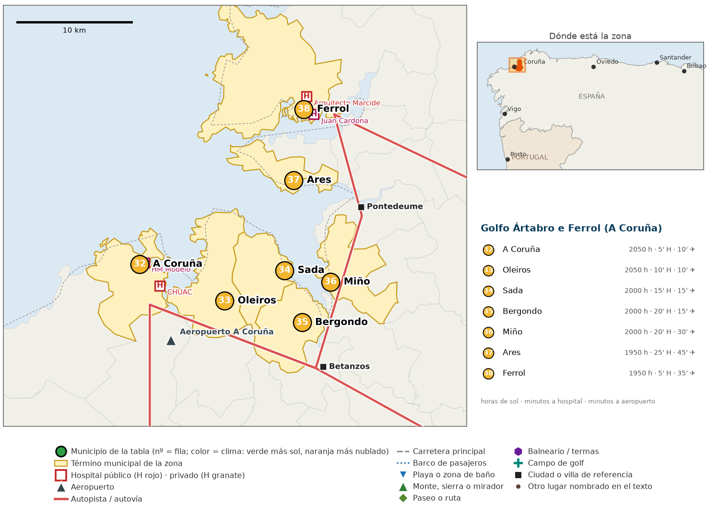

## 8. Golfo Ártabro e Ferrol (A Coruña) · A Coruña, Oleiros, Sada, Bergondo, Miño, Ares, Ferrol

### La zona

El arco de rías que rodea A Coruña (250.000 hab.): la ría de O Burgo y Oleiros al este de la ciudad, la ría de Betanzos (Sada, Bergondo, Miño), la ría de Ares (Ares, Redes, Mugardos) y Ferrol al norte. Oleiros es el municipio más rico de Galicia y el modelo de urbanización que describes: Santa Cruz, Mera, Perillo, Bastiagueiro y Santa Cristina son barrios de casas bajas y chalés, calles limpias, playas y paseo, a 10 min del centro de A Coruña y del CHUAC. Sada tiene puerto deportivo y villa; Bergondo es residencial y rural junto a la ría y al pazo de Mariñán; Miño tiene la Praia Grande y la urbanización de Costa Miño con su campo de golf; Ares es una aldea de ría con Redes, uno de los pueblos marineros más bonitos de Galicia; Ferrol es una ciudad naval de 64.000 habitantes en declive, con playas atlánticas frías.

La zona es urbanismo y logística de primera con el cielo más gris de las rías gallegas.

### Clima mes a mes

| | Oct-Mar | Abr-May | Jun-Sep | Año |
|---|---|---|---|---|
| Días de lluvia al mes | 13-16 | 10-12 | 5-8 | 128-132 |
| Máxima / mínima típica | 13 / 8 °C (ene.) | 17 / 10 °C | 23 / 15 °C (jul.) | |
| Horas de sol al mes | 80-120 | 180-210 | 230-260 | 1.950-2.050 |

Sol 1.950-2.050 h, 45-50 días despejados, 150-155 cubiertos. Lluvia moderada en cantidad (1.000-1.100 mm, menos que las Rías Baixas) pero repartida en 128-132 días, con llovizna y cielo cubierto frecuentes, también en verano (5-8 días de lluvia al mes en julio y agosto). Verano fresco: 19 °C de media, 23 °C de máxima típica, 1-2 días > 30 °C. Invierno el más suave de Galicia (mínimas de 8 °C). Viento medio en A Coruña, Oleiros y Ares; niebla media en A Coruña, Bergondo, Ares y Ferrol. Comparado con Mancor: 750-850 h de sol menos y menos de la mitad de días despejados; es el clima más distinto al tuyo dentro de Galicia.

### Mar y baño

Oleiros: Santa Cristina (paseo, ría), Bastiagueiro (surf suave), Mera y Espiñeiro (arena, faro). Sada: Sada (urbana), Cirro; Bergondo: Gandarío (larga, de ría, agua templada 18-20 °C) y Pedrido. Miño: Praia Grande (1,3 km, dunas), Perbes. Ares: Ares, Seselle, Chanteiro (frente a A Coruña). A Coruña: Riazor y Orzán (urbanas, atlánticas), Oza, As Lapas. Ferrol: Doniños (laguna, oleaje), San Xurxo, A Frouxeira (Valdoviño): playas bravas y frías (16-18 °C). En la ría de Betanzos el agua es de las más templadas de la tabla; en la costa abierta, de las más frías.

### Paseos y montaña

Paseo marítimo de A Coruña (13 km, el más largo de Europa) y Torre de Hércules; Monte de San Pedro; Monumento Natural de Dexo-Serantes (Oleiros, acantilados y senda costera de 10 km); senda de la ría do Burgo; Fragas do Eume (Pontedeume, a 15 min de Miño: bosque atlántico, parque natural, rutas); Pazo de Mariñán y monasterio de Bergondo; Betanzos (casco histórico, Os Caneiros); Redes y Mugardos (Ares); Cabo Prior y Cabo Prioriño (Ferrol). Montaña: no; el relieve es suave (montes de 200-400 m).

### Servicios y ciudad de referencia

A Coruña 10/10 (comercio, cultura, sanidad, universidad, El Corte Inglés, Marineda City, AVE a Madrid). Oleiros 7/10 y Sada 7/10 (centros de salud, supermercados grandes, comercio, colegios; casi todo sin entrar en la ciudad). Ferrol 9/10 pero en decadencia comercial. Bergondo, Miño y Ares 4/10 (lo básico; Betanzos y Pontedeume completan a 5-10 min). Ciudad de referencia: A Coruña a 10-20 min desde Oleiros, Sada y Bergondo; 25-30 desde Miño.

### Sanidad

CHUAC (A Coruña, público, de referencia de Galicia norte): 5 min desde la ciudad, 10 desde Oleiros, 15 desde Sada, 20 desde Bergondo y Miño. HM Modelo, Quirónsalud A Coruña y San Rafael (privados): 5-25. Ferrol y Ares: Arquitecto Marcide (público) y Juan Cardona (privado) a 5-25. La segunda mejor sanidad de la tabla con Vigo.

### Aeropuertos y Palma

Alvedro (A Coruña) a 10 min desde la ciudad y Oleiros, 15 desde Sada y Bergondo, 30 desde Miño, 35-45 desde Ferrol y Ares: vuelo a Palma en verano. Santiago (Palma casi todo el año) a 45-50 min desde Oleiros y Bergondo, 50 desde A Coruña y Miño, 65-75 desde Ferrol y Ares.

### Precios y qué compras con 260.000 €

A Coruña 2.600 €/m² y Oleiros 2.500: 2 habitaciones franja A 211.000-220.000 (entra), 3 habitaciones 292.000-304.000 (no). Sada 2.100: 2 habitaciones 177.000, 3 habitaciones 246.000 (entra). Bergondo 1.700 (3 habitaciones 199.000), Miño 1.600 (187.000), Ares 1.500 (176.000), Ferrol 1.200 (140.000). Obra nueva en A Coruña, Oleiros y Sada; poca en el resto. Fibra en A Coruña, Oleiros, Sada y Ferrol; parcial en Bergondo, Miño y Ares.

### Seguridad y ambiente

Oleiros 36/1.000 y Culleredo 37 (área metropolitana muy segura); Ferrol 48; A Coruña ciudad en la media de las capitales. Población extranjera 5-7 %. Ambiente: Oleiros y Sada son residenciales de clase media-alta coruñesa, ordenados y limpios, con mucho jubilado; Bergondo y Miño, rurales-residenciales; Ares, aldea; Ferrol, ciudad con problemas de despoblación y empleo.

### Parecido con Mancor / Mallorca

En urbanismo, el más alto de la tabla: Oleiros y Costa Miño son la "urbanización mallorquina" con playa (4/5). En clima, el más bajo de Galicia (1/5): 50 días despejados frente a 120. En paisaje, sin montaña.

### Lo que no tendrás

- Sol: 1.950-2.050 h y 150 días cubiertos; llovizna también en verano.
- 3 habitaciones en primera línea de Oleiros o A Coruña en presupuesto.
- Montaña detrás.
- Mar cálido en la costa abierta (Ferrol, Riazor: 16-18 °C).
- Vida en invierno en Ares y Miño (servicios 4/10).
- Vuelo a Palma todo el año desde Alvedro.

### Municipio a municipio

**A Coruña (nº 32).** 250.000 habitantes en una península: Torre de Hércules, paseo marítimo, casco viejo, Marina con galerías, Riazor-Orzán, Monte de San Pedro. Ciudad compacta y muy vivible, sin coche (dependencia 2/10). Servicios 10/10, hospital 5, aeropuerto 10, AVE a Madrid. Precio 2.600: 2 habitaciones franja A 220.000; barrio bajo con vistas dentro del presupuesto casi no existe. Para quién: quien prefiera ciudad completa junto al mar. Para ti, la ciudad de referencia; para vivir, Oleiros.

**Oleiros (nº 33).** 38.000 habitantes repartidos en núcleos residenciales junto al mar: Santa Cruz (castillo en un islote, paseo, puerto), Mera (faro, playas, pueblo bajo), Perillo y Santa Cristina (paseo de la ría, playa), Bastiagueiro (playa, INEF), Dexo-Serantes (acantilados). Municipio con más parques y equipamientos por habitante de Galicia; casas bajas, calles limpias, chalés. Servicios 7/10, comunicaciones 8/10. Hospital CHUAC 10, HM Modelo 15. Aeropuerto 10. Precio 2.500: 2 habitaciones franja A 211.000; 3 habitaciones 292.000 (fuera); casa en urbanización desde 300.000. Obra nueva sí; fibra sí. Facilidad de venta 9/10. Seguridad 36. Para quién: el que quiera exactamente urbanización ordenada, segura y con playa a 10 min de una ciudad grande, y acepte 50 días despejados al año y precio alto.

**Sada (nº 34).** 17.000 habitantes; villa con puerto deportivo (Fontán), paseo, playa urbana de ría (agua templada), comercio y centro de salud; Gandarío a 5 min. Servicios 7/10. Hospital 15. Aeropuerto 15. Precio 2.100: 3 habitaciones franja A 246.000 (entra). Obra nueva sí; fibra sí. Para quién: quien quiera villa con puerto y agua de ría templada, algo más barata que Oleiros, a 15 min de A Coruña.

**Bergondo (nº 35).** 7.000 habitantes en parroquias residenciales y rurales junto a la ría de Betanzos: Gandarío (playa larga de ría, 18-20 °C) y Pedrido a 5 min, pazo de Mariñán, monasterio de San Salvador, Betanzos (casco histórico, 10 min). Servicios 4/10; dependencia del coche 8/10; fibra parcial. Hospital 20. Aeropuerto 15. Precio 1.700: 3 habitaciones 199.000; casa con terreno 200.000-260.000. Poca obra nueva. Niebla media. Para quién: quien quiera casa con jardín en zona rural-residencial tranquila, a 15-20 min de A Coruña y del aeropuerto.

**Miño (nº 36).** 6.000 habitantes; Praia Grande (1,3 km, dunas, paseo), Perbes, y la urbanización Costa Miño (casas bajas, campo de golf, construida en los 2000), con Pontedeume (villa histórica) y las Fragas do Eume a 5-15 min. Servicios 4/10; fibra parcial. Hospital 20. Aeropuerto 30. Precio 1.600: 3 habitaciones franja A 187.000; casa en Costa Miño 200.000-280.000. Poca obra nueva. Para quién: quien quiera urbanización con golf y playa grande a precio razonable, aceptando servicios mínimos en el municipio.

**Ares (nº 37).** 6.000 habitantes en la ría de Ares: villa pequeña con playa urbana, Redes (aldea marinera de casas de colores, una de las más bonitas de Galicia), Seselle y Chanteiro frente a A Coruña. Viento y niebla medios. Servicios 5/10; fibra parcial; coche 7/10. Hospital (Ferrol) 25. Aeropuerto 45. Precio 1.500: 3 habitaciones 176.000. Para quién: quien quiera aldea de ría con encanto y acepte tener todo en Ferrol o A Coruña (30-40).

**Ferrol (nº 38).** 64.000 habitantes (fueron 90.000); ciudad ilustrada (barrio de la Magdalena, arsenal, astilleros Navantia), playas atlánticas bravas y frías (Doniños, San Xurxo, A Frouxeira a 15 min), castillo de San Felipe, Cabo Prior. Servicios 9/10 sobre el papel, con comercio en retroceso. Hospital 5 (público y privado). Aeropuerto 35. Precio 1.200 (el más bajo de la zona): 3 habitaciones franja A 140.000. Seguridad 48/1.000; revalorización 5/10 (la más baja de la tabla). Para quién: no para tu perfil; solo por precio y sanidad a pie.

### Si yo fuera tú

Oleiros (Mera, Santa Cruz) si te quedas con la urbanización limpia y segura y A Coruña a 10 min como Inca, o Costa Miño si prefieres golf, playa grande y pagar menos. Es la zona donde más "urbanización de Mallorca" vas a sentir, con el cielo más gris de las Rías.

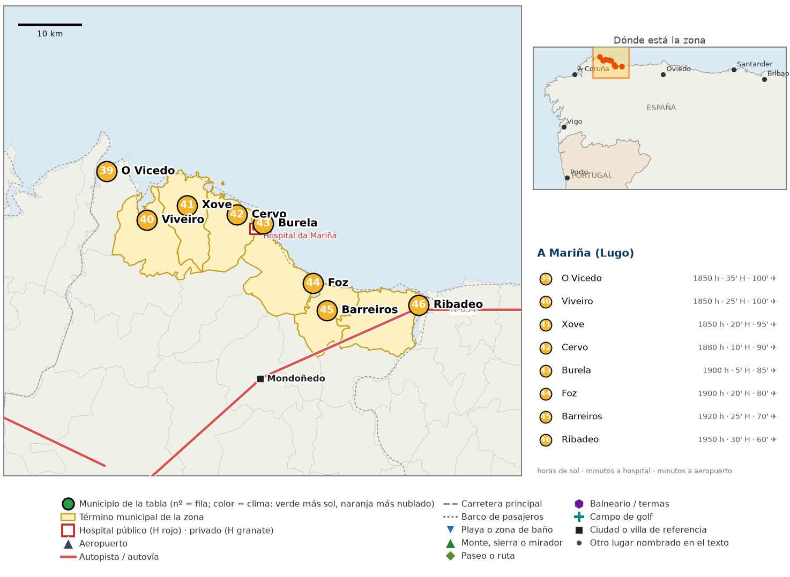

## 9. A Mariña (Lugo) · O Vicedo, Viveiro, Xove, Cervo, Burela, Foz, Barreiros, Ribadeo

### La zona

La costa norte de la provincia de Lugo, ya en el Cantábrico: acantilados, playas espectaculares (As Catedrais, Esteiro, Covas, Xilloi), rías pequeñas (Viveiro, Foz, Ribadeo) y villas marineras de 4.000 a 15.000 habitantes. Viveiro es la villa amurallada con la ría abrigada de Covas; Burela, el puerto del bonito y el hospital comarcal; Foz y Ribadeo, villas de veraneo con casco histórico; Barreiros, una costa de apartamentos de veraneo construidos en los 2000; Cervo y Xove viven de la planta de aluminio de San Cibrao (Alcoa), con su incertidumbre laboral; O Vicedo es el extremo occidental, junto a Estaca de Bares.

Es la zona más barata de la tabla y la más alejada de lo que buscas en clima, ciudad, hospital privado y aeropuerto.

### Clima mes a mes

| | Oct-Mar | Abr-May | Jun-Sep | Año |
|---|---|---|---|---|
| Días de lluvia al mes | 14-17 | 12-14 | 7-10 | 140-150 |
| Máxima / mínima típica | 13 / 6 °C (ene.) | 16 / 9 °C | 22 / 14 °C (jul.) | |
| Horas de sol al mes | 70-110 | 170-200 | 210-240 | 1.850-1.950 |

Sol 1.850-1.950 h, 40 días despejados, 165 cubiertos. Lluvia 1.000-1.150 mm en 140-150 días, con 7-10 días al mes también en verano. Verano el más fresco de la tabla: 18-18,5 °C de media, máximas típicas de 22 °C, 0-1 días > 30 °C. Niebla alta (la costa de Lugo es la más brumosa de Galicia), humedad 81-83 %. Viento medio. Comparado con Mancor: 850-950 h de sol menos; 80 días despejados menos; cielo cubierto casi la mitad del año.

### Mar y baño

Covas (Viveiro; larga, en ría abrigada), Area y Sacido (Viveiro), Xilloi y Arealonga (O Vicedo), Esteiro (Xove; arcos de roca, surf), Cubelas y O Torno (Cervo), A Marosa y Ril (Burela), A Rapadoira, Llas y Peizás (Foz), Arealonga, Altar y Coto (Barreiros), As Catedrais y Os Bloques (Ribadeo). Agua 17-19 °C. Mar abierto y bravo casi siempre; para bañarse con calma, las rías de Viveiro y Foz.

### Paseos y montaña

Fuciño do Porco (O Vicedo; pasarelas sobre el acantilado); Estaca de Bares (punto más septentrional de la península, a 20 min de O Vicedo); Souto da Retorta (Viveiro; eucaliptos gigantes); Monte San Roque (Viveiro; mirador); Paseo dos Namorados y Real Fábrica de Sargadelos (Cervo); Cabo Burela; San Martiño de Mondoñedo (Foz; la catedral más antigua de España) y Mondoñedo (20 min); As Catedrais y la ruta costera Ribadeo-Rinlo; Illa Pancha y casco indiano de Ribadeo; Reserva de la Biosfera del Eo. Montaña: la sierra del Xistral (1.000 m) a 30-40 min, muy lluviosa.

### Servicios y ciudad de referencia

Viveiro 6/10 y Ribadeo 7/10 (villas completas con comercio, mercado, centro de salud); Burela 6/10 (hospital, puerto); Foz 5/10; Barreiros 3/10; Cervo y Xove 3-4/10; O Vicedo 2/10. No hay ciudad: Lugo (98.000) a 1 h 15, A Coruña a 1 h 45, Oviedo a 1 h 45.

### Sanidad

Hospital da Mariña (Burela, público, comarcal): 5 min desde Burela, 10 desde Cervo, 20 desde Xove y Foz, 25 desde Viveiro y Barreiros, 35 desde O Vicedo y Ribadeo. Ribadeo tiene además el hospital de Jarrio (Asturias) a 30 min, aunque tu tarjeta gallega te enviaría a Burela. Hospital privado: ninguno en la comarca (el más cercano en Lugo o Oviedo, a más de 1 h 15).

### Aeropuertos y Palma

Asturias (Palma en verano) a 60 min desde Ribadeo, 70-80 desde Barreiros y Foz, 85-100 desde el resto. Santiago (Palma casi todo el año) a 100-120 min.

### Precios y qué compras con 260.000 €

Los más bajos de toda la tabla: O Vicedo 900 €/m², Xove 950, Cervo 1.000, Barreiros 1.150, Burela 1.200, Viveiro 1.250, Foz 1.300, Ribadeo 1.400. 3 habitaciones franja A entre 105.000 (O Vicedo) y 164.000 (Ribadeo). Con 260.000 € compras dos viviendas o una casa grande con vistas al mar con mucho margen. Obra nueva: ninguna en la mayoría, poca en Viveiro, Burela, Foz, Barreiros y Ribadeo. Fibra en Viveiro, Burela, Foz y Ribadeo; parcial en el resto.

### Seguridad y ambiente

Ninguno supera 20.000 habitantes; Lugo es una de las provincias más tranquilas de España y Galicia está en 35/1.000. Población extranjera baja (3-5 %; Burela tiene una comunidad caboverdiana histórica ligada a la pesca). Ambiente: villas de pesca, industria y veraneo gallego-castellano; muy tranquilo diez meses al año.

### Parecido con Mancor / Mallorca

1/5. Es la Galicia verde, húmeda y brumosa: paisaje de prados, eucaliptos y acantilados. Nada del sol, la piedra seca ni la luz de Mallorca.

### Lo que no tendrás

- Sol: 165 días cubiertos, 40 despejados, niebla frecuente.
- Ninguna ciudad a menos de 1 h 15.
- Hospital privado en la comarca.
- Aeropuerto a menos de 60-100 min; Palma casi todo el año a 2 h.
- Obra nueva ni urbanizaciones de calidad.
- Verano cálido: nunca hace calor, y llueve 7-10 días al mes en julio y agosto.

### Municipio a municipio

**O Vicedo (nº 39).** 1.700 habitantes en el extremo oeste, junto a la ría do Barqueiro: Xilloi, Arealonga y Vidreiro (playas), Fuciño do Porco, Estaca de Bares a 20 min. Servicios 2/10 (los más bajos de la tabla); coche 9/10. Hospital 35. Aeropuerto 100. Precio 900: 3 habitaciones 105.000. Para quién: solo para retiro aislado junto al mar por muy poco dinero.

**Viveiro (nº 40).** 15.000 habitantes; casco amurallado (Porta de Carlos V), puerto de Celeiro (merluza del pincho), ría abrigada con la playa de Covas (larga y urbana), Semana Santa declarada de interés turístico internacional, Souto da Retorta, tren de vía estrecha a Ferrol y Oviedo. Servicios 6/10. Hospital 25. Aeropuerto 100. Precio 1.250: 3 habitaciones franja A 146.000. Poca obra nueva; fibra sí. Para quién: la única opción con vida propia todo el año en la Mariña occidental.

**Xove (nº 41).** 3.300 habitantes; Esteiro (playa de arcos, surf) y Portocelo; planta de Alcoa en su término. Servicios 3/10. Hospital 20. Precio 950. Para quién: no para tu perfil.

**Cervo (nº 42).** 4.000 habitantes; San Cibrao (península con puerto, Museo Provincial do Mar, playas de Cubelas y O Torno) y Sargadelos (cerámica, ruta del río Xunco). Servicios 4/10. Hospital 10. Precio 1.000. Para quién: solo por San Cibrao y el hospital a 10.

**Burela (nº 43).** 9.000 habitantes; puerto del bonito del norte, hospital comarcal, villa de servicios sin casco histórico. Playas A Marosa y Ril. Servicios 6/10. Hospital 5. Aeropuerto 85. Precio 1.200: 3 habitaciones 140.000. Para quién: quien quiera hospital a pie en la Mariña.

**Foz (nº 44).** 10.000 habitantes; villa de veraneo con paseo, ría, playas urbanas (A Rapadoira) y abiertas (Llas, Peizás), San Martiño de Mondoñedo a 5 min. Servicios 5/10. Hospital 20. Aeropuerto 80. Precio 1.300: 3 habitaciones 152.000. Para quién: quien quiera villa cantábrica de veraneo tranquila y barata.

**Barreiros (nº 45).** 3.000 habitantes con 8 km de playas (Arealonga, Altar, Coto, Remior) y muchos bloques de apartamentos de los 2000 vacíos en invierno; As Catedrais a 5 min. Servicios 3/10; fibra parcial. Hospital 25. Aeropuerto 70. Precio 1.150. Para quién: segunda residencia, no vivienda de todo el año.

**Ribadeo (nº 46).** 10.000 habitantes; casco indiano (Torre dos Moreno), puerto, Illa Pancha, ría del Eo frente a Castropol, As Catedrais a 10 min, A-8. Servicios 7/10 (la villa más completa de la zona). Hospital Jarrio 30 / Burela 35. Aeropuerto de Asturias 60 (el único de la zona en el límite deseable). Precio 1.400: 3 habitaciones franja A 164.000. Poca obra nueva; fibra sí. Dependencia del coche 4/10. Para quién: la única opción de la Mariña con aeropuerto a 1 h y villa completa; el sol sigue siendo el de la Mariña.

### Si yo fuera tú

No iría. Es la zona que más se aleja de tus cuatro prioridades (sol, servicios, hospital, aeropuerto). Si alguna vez la miras, solo Viveiro o Ribadeo, y solo por precio.

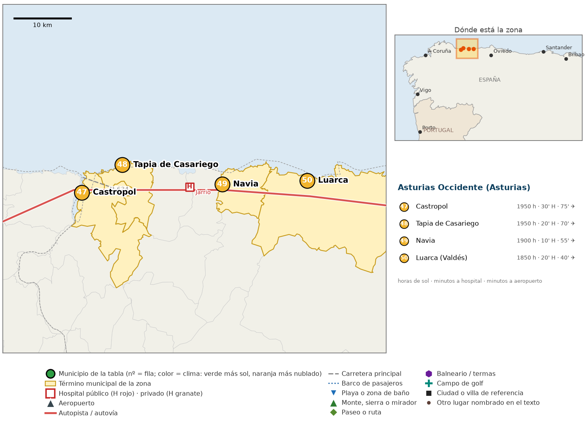

## 10. Asturias Occidente (Asturias) · Castropol, Tapia de Casariego, Navia, Luarca (Valdés)

### La zona

La Asturias verde y marinera del oeste, entre la ría del Eo y el Cabo Busto: Castropol (pueblo blanco colgado sobre la ría, frente a Ribadeo), Tapia (villa de puerto con casco marinero y surf), Navia (villa de servicios en su ría, con Puerto de Vega al lado, uno de los pueblos marineros más bonitos de Asturias) y Luarca (la "villa blanca de la Costa Verde": puerto, cementerio sobre el acantilado, faro, palacetes de Indianos). La A-8 corre paralela a la costa; el hospital comarcal está en Jarrio (Coaña) y el aeropuerto de Asturias a 40-75 min.

Es una costa auténtica, barata y tranquila, con cielo cantábrico: cubierto la mitad del año.

### Clima mes a mes

| | Oct-Mar | Abr-May | Jun-Sep | Año |
|---|---|---|---|---|
| Días de lluvia al mes | 14-16 | 12-13 | 7-10 | 138-145 |
| Máxima / mínima típica | 13 / 6 °C (ene.) | 16 / 9 °C | 22-23 / 15 °C (jul.) | |
| Horas de sol al mes | 70-110 | 170-200 | 210-240 | 1.850-1.950 |

Sol 1.850-1.950 h, 40-42 días despejados, 165 cubiertos. Lluvia 950-1.050 mm en 138-145 días (cantidad moderada, frecuencia alta). Verano 18,5 °C de media, 1-2 días > 30 °C. Niebla alta en Tapia y Castropol, media en Navia y Luarca. Viento medio. Comparado con Mancor: 850-950 h de sol menos; días despejados a un tercio.

### Mar y baño

Penarronda (dunas, entre Castropol y Tapia), Arnao, Anguileiro-Represas y Serantes (Tapia; surf), Mexota, Navia, Frexulfe (monumento natural), Barayo (reserva natural, entre Navia y Valdés), Luarca (1ª y 2ª), Otur, Cueva, Cadavedo. Agua 18-20 °C en agosto. Mar abierto, bravo; bañarse con calma en las rías de Navia y del Eo.

### Paseos y montaña

Ruta costera Tapia-Figueras; paseo de la ría del Eo (Reserva de la Biosfera Río Eo, Oscos e Terras de Burón); castro de Coaña (5 min de Navia); ruta de la ría de Navia; Puerto de Vega (paseo, mirador); Cabo Busto (senda circular); Luarca: ruta de los miradores, faro, Jardines de la Fonte Baxa; Cadavedo. Montaña: la sierra de la Bobia y los Oscos a 45 min (verde, lluvioso).

### Servicios y ciudad de referencia

Navia 6/10 (villa completa con centro de salud, comercio, mercado, cine), Tapia 6/10, Luarca 6/10 (villa con vida todo el año), Castropol 3/10. Ciudad: Oviedo (220.000) y Avilés a 1 h; Ribadeo a 10 min desde Castropol.

### Sanidad

Hospital de Jarrio (Coaña, público, comarcal): 10 min desde Navia, 20 desde Tapia y Luarca, 30 desde Castropol. Privado: Centro Médico de Asturias (Oviedo) a 1 h 10. HUCA (Oviedo) a 1 h para lo que Jarrio no cubre.

### Aeropuertos y Palma

Asturias (Palma en verano) a 40 min desde Luarca, 55 desde Navia, 70 desde Tapia, 75 desde Castropol. Santiago (Palma casi todo el año) a 2 h.

### Precios y qué compras con 260.000 €

Castropol 1.050 €/m², Navia 1.100, Luarca 1.300, Tapia 1.350. 3 habitaciones franja A entre 129.000 (Navia) y 158.000 (Tapia). Casas de Indianos rehabilitadas 150.000-260.000. Sin obra nueva (Castropol) o muy poca. Fibra en Tapia, Navia y Luarca; parcial en Castropol.

### Seguridad y ambiente

Ninguno supera 20.000 habitantes; Asturias 36/1.000. Población extranjera baja (4-6 %). Ambiente: villas de pesca y veraneo asturiano-madrileño, tranquilas, con mucha población mayor.

### Parecido con Mancor / Mallorca

2/5: pueblos pequeños y cuidados con mar, pero de piedra oscura, pizarra y prado; sin sol ni piedra seca.

### Lo que no tendrás

- Sol: 165 días cubiertos.
- Hospital privado a menos de 1 h.
- Ciudad a menos de 1 h.
- Vuelo a Palma todo el año (Santiago a 2 h).
- Obra nueva.
- Verano de terraza: 7-10 días de lluvia al mes en julio y agosto.

### Municipio a municipio

**Castropol (nº 47).** 3.400 habitantes; pueblo blanco en un promontorio sobre la ría del Eo, Figueras (astilleros, palacio de Peñalba), Penarronda a 10 min (franja B). Servicios 3/10. Hospital 30. Aeropuerto 75. Precio 1.050. Para quién: quien quiera vistas a la ría desde un pueblo blanco y tenga a Ribadeo (10 min) como villa de servicios.

**Tapia de Casariego (nº 48).** 3.800 habitantes; puerto, casco marinero cuidado, isla del faro, playas de surf a 2 min, paseo costero. Niebla alta. Servicios 6/10. Hospital 20. Aeropuerto 70. Precio 1.350: 3 habitaciones 158.000. Para quién: quien quiera villa marinera pequeña y muy cuidada, con Ribadeo y Navia a 15-20.

**Navia (nº 49).** 8.500 habitantes; villa de servicios en su ría, paseo, playa a 5 min, Puerto de Vega a 5 min, castro de Coaña, A-8. Servicios 6/10. Hospital 10 (el mejor tiempo de la zona). Aeropuerto 55. Precio 1.100: 3 habitaciones 129.000. Para quién: la práctica: hospital, autovía y servicios, menos encanto que Luarca.

**Luarca (nº 50).** 4.500 habitantes (12.000 en el concejo de Valdés); la villa blanca: puerto, siete puentes sobre el río Negro, cementerio y ermita sobre el acantilado, faro, casas de Indianos, mercado. Playas 1ª y 2ª en la villa; Otur, Cueva y Cadavedo a 10-15. Servicios 6/10. Hospital 20. Aeropuerto 40 (el mejor de la zona). Precio 1.300: 3 habitaciones franja A 152.000. Fibra sí. Para quién: la más bonita y la mejor comunicada de la Asturias occidental. Si eliges esta zona, aquí.

### Si yo fuera tú

Luarca, por encanto y aeropuerto a 40 min, si la Asturias verde te enamora en una visita. Por criterios, no es tu zona.

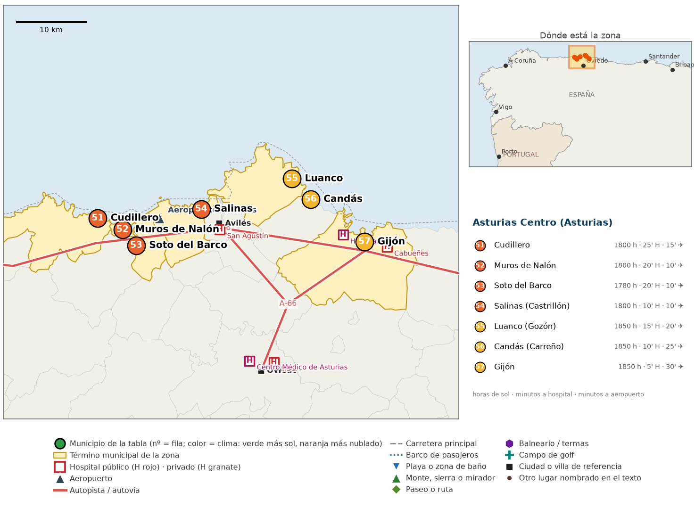

## 11. Asturias Centro (Asturias) · Cudillero, Muros de Nalón, Soto del Barco, Salinas (Castrillón), Luanco (Gozón), Candás (Carreño), Gijón

### La zona

La costa del área metropolitana asturiana: Gijón (270.000 hab.), Avilés (77.000) y Oviedo (220.000, con el HUCA) a 10-30 minutos de cualquier punto, y el aeropuerto de Asturias en Santiago del Monte (Castrillón), a 10 min de Salinas. Cudillero es el pueblo colgado de postal; Muros y Soto del Barco, el estuario tranquilo del Nalón; Salinas, la villa-playa residencial de chalés y casas bajas junto a Avilés; Luanco y Candás, villas marineras del Cabo Peñas; Gijón, la ciudad de mar de Asturias.

Es la zona con mejor logística del Cantábrico occidental (aeropuerto, tres ciudades, cuatro hospitales) y con dos matices: cielo cantábrico y una industria pesada (siderurgia de Avilés y Gijón, central y cementera de Aboño) que se nota en el aire según el viento.

### Clima mes a mes

| | Oct-Mar | Abr-May | Jun-Sep | Año |
|---|---|---|---|---|
| Días de lluvia al mes | 14-16 | 12-13 | 8-10 | 145-150 |
| Máxima / mínima típica | 13 / 6 °C (ene.) | 16 / 9 °C | 23 / 16 °C (jul.) | |
| Horas de sol al mes | 70-100 | 160-190 | 200-230 | 1.780-1.850 |

Sol 1.780-1.850 h, 42-45 días despejados, 162-165 cubiertos. Lluvia 1.000-1.150 mm en 145-150 días, con 8-10 días al mes en verano. Verano 19-19,5 °C de media, máximas de 23 °C, 1-3 días > 30 °C (con viento sur pueden llegar puntas de 33-35 °C un par de días al año). Niebla media en Cudillero, Muros, Soto; baja en el resto. Viento medio en la costa de Peñas. Comparado con Mancor: 950-1.000 h de sol menos.

### Mar y baño

Aguilar y Concha de Artedo (Cudillero), Playa del Silencio (Castañeras, 15 min), Los Quebrantos (San Juan de la Arena, Soto), Salinas-El Espartal (3 km con San Juan de Nieva; dunas), Bahínas, Arnao y Santa María del Mar (Castrillón), Xagó (Gozón; dunas, surf), La Ribera y Aramar (Luanco), Palmera y Carranques (Candás), Xivares, San Lorenzo (Gijón; 1,5 km urbana), Poniente. Agua 19-21 °C en agosto, la más templada del Cantábrico en la tabla.

### Paseos y montaña

Cabo Vidio (Cudillero; faro, senda); Ruta de los Miradores de Muros de Nalón (7 miradores sobre la desembocadura); Quinta de Selgas (El Pito); paseo de Salinas y Museo de Anclas (Peñona); Cabo Peñas (Gozón; faro, acantilados, senda); Senda del Cervigón y Cerro de Santa Catalina (Gijón); Jardín Botánico Atlántico; Parque de Isabel la Católica. Montaña: la sierra del Aramo y el Sueve a 45-60 min; Picos a 1 h 30.

### Servicios y ciudad de referencia

Gijón 10/10. Salinas 7/10 (villa con todo, Avilés a 10 con casco histórico y Centro Niemeyer). Luanco 5/10, Candás 6/10 (villas completas en lo básico; Gijón a 20-25). Cudillero 4/10 (turístico, cuestas). Muros 3/10 y Soto del Barco 4/10 (lo básico; Avilés a 15). Ciudad de referencia: Avilés a 10-15 desde Salinas, Soto y Muros; Gijón a 20-25 desde Luanco y Candás; Oviedo a 30-45 desde todos.

### Sanidad

San Agustín (Avilés, público): 10 min desde Salinas, 20 desde Luanco, Muros y Soto, 25 desde Cudillero. Cabueñes (Gijón, público) y Hospital de Jove (Gijón): 5 desde Gijón, 10 desde Candás, 15 desde Luanco. HUCA (Oviedo, de referencia de Asturias, uno de los mejores de España) a 30-45. Privados: Centro Médico de Asturias (Oviedo) a 30-45, Sanatorio Covadonga (Gijón), Jove. La mejor sanidad del Cantábrico occidental.

### Aeropuertos y Palma

Asturias (Palma en verano) a 10 min desde Salinas, Muros y Soto, 15 desde Cudillero, 20-25 desde Luanco y Candás, 30 desde Gijón. Santander (Palma casi todo el año) a 2 h 15.

### Precios y qué compras con 260.000 €

Muros 1.100 €/m², Soto 1.200, Cudillero 1.400, Candás 1.650, Salinas 1.700, Luanco 1.800, Gijón 2.300. 3 habitaciones franja A: Muros 129.000, Salinas 199.000, Luanco 211.000, Gijón 269.000 (fuera en primera línea; entra a 5-10 min). Obra nueva solo en Gijón; poca en Salinas, Luanco y Candás; ninguna en Cudillero, Muros y Soto. Fibra en todos menos Muros y Soto (parcial).

### Seguridad y ambiente

Castrillón 33/1.000, Avilés 30, Gijón 39, Oviedo 35 (toda el área es más segura que Inca). Población extranjera 5-7 %. Ambiente: Salinas residencial de clase media avilesina y ovetense; Luanco y Candás villas marineras con veraneo de Oviedo; Gijón ciudad abierta y de paseo; Cudillero turístico de día. Aire: la siderurgia de Avilés (a 3 km de Salinas, a favor del viento del sur) y Aboño (junto a Candás y Xivares) son un tema real en Castrillón, Carreño y el oeste de Gijón.

### Parecido con Mancor / Mallorca

2/5 en general; 3/5 en Salinas (villa de casas bajas junto a la playa con paseo y ambiente de urbanización, tipo Playa de Palma antigua). Sin montaña cerca ni sol.

### Lo que no tendrás

- Sol: 1.800 h, 165 días cubiertos.
- Aire limpio garantizado cerca de Avilés y Aboño.
- Obra nueva fuera de Gijón.
- Vuelo a Palma todo el año.
- Calma en Cudillero en verano.
- Montaña a menos de 45 min.

### Municipio a municipio

**Cudillero (nº 51).** 5.000 habitantes en el concejo; el pueblo es un anfiteatro de casas colgadas sobre el puerto, precioso y lleno de visitantes de día, con cuestas que a los 70 años pesan. Playas: Aguilar y Concha de Artedo a 5 min, el Silencio a 15. Cabo Vidio. Servicios 4/10. Hospital 25. Aeropuerto 15. Precio 1.400: 3 habitaciones 164.000. Sin obra nueva. Para quién: para visitar; para vivir, solo en El Pito (llano, arriba) y con coche.

**Muros de Nalón (nº 52).** 1.800 habitantes en la orilla oeste de la desembocadura del Nalón: Ruta de los Miradores, playa de Aguilar a 5 min, muy barato (1.100). Servicios 3/10; fibra parcial; coche 8/10. Hospital 20. Aeropuerto 10. Para quién: retiro muy tranquilo a 10 min del aeropuerto por poco dinero.

**Soto del Barco (nº 53).** 4.000 habitantes; San Juan de la Arena (pueblo marinero, Los Quebrantos, angulas), castillo de San Martín, estuario del Nalón. Servicios 4/10; fibra parcial. Hospital 20. Aeropuerto 10. Precio 1.200: 3 habitaciones 140.000. Para quién: quien quiera estuario tranquilo, playa larga y Avilés a 15.

**Salinas (Castrillón) (nº 54).** 5.000 habitantes en la villa (23.000 en el concejo); playa de 3 km con dunas, paseo, Museo de Anclas, casas bajas y chalés de los años 60-2000, ambiente residencial; Avilés a 10 min (casco histórico, Niemeyer, comercio); Piedras Blancas (capital) a 5. Servicios 7/10. Hospital San Agustín 10, Jove 30. Aeropuerto 10. Precio 1.700: 3 habitaciones franja A 199.000. Poca obra nueva; fibra sí. Facilidad de venta 8/10. Seguridad 33. Contra: la siderurgia a 3 km. Para quién: la opción para tu perfil en Asturias: villa-urbanización con playa y la mejor logística de la región.

**Luanco (Gozón) (nº 55).** 5.000 habitantes; villa marinera con casco de piedra, Museo Marítimo, playas urbanas (La Ribera, Aramar) y Xagó a 10; Cabo Peñas a 10. Servicios 5/10. Hospital Jove 15, Avilés 20. Aeropuerto 20. Precio 1.800: 3 habitaciones 211.000. Poca obra nueva. Para quién: quien quiera villa marinera cuidada entre Avilés y Gijón, con el Cabo Peñas al lado.

**Candás (Carreño) (nº 56).** 7.000 habitantes; puerto, faro, playas (Palmera, Carranques), cercanías a Gijón, Museo Antón. Contra: Aboño (central térmica y cementera) al lado. Servicios 6/10. Hospital Jove 10. Aeropuerto 25. Precio 1.650: 3 habitaciones 193.000. Para quién: quien quiera Gijón a 15 min en tren desde una villa marinera, aceptando la industria vecina.

**Gijón (nº 57).** 270.000 habitantes; San Lorenzo con su paseo del Muro, Cimadevilla, Poniente, parques, universidad, cultura, comercio; ciudad de mar completa y abierta. Servicios 10/10. Hospital 5. Aeropuerto 30. Precio 2.300: 2 habitaciones franja A 194.000, 3 habitaciones 269.000 (entra a 5-10 min de la playa). Obra nueva sí. Seguridad 39. Dependencia del coche 2/10. Para quién: quien quiera ciudad; para tu perfil, los barrios de Somió (chalés, casas bajas, a 5 min de la playa) son la versión urbanización, a precio alto.

### Si yo fuera tú

Salinas, si aceptas mil horas menos de sol que en Mancor a cambio de aeropuerto, hospital y ciudad a 10 min y una villa de casas bajas junto a la playa. En Asturias es la que más encaja.

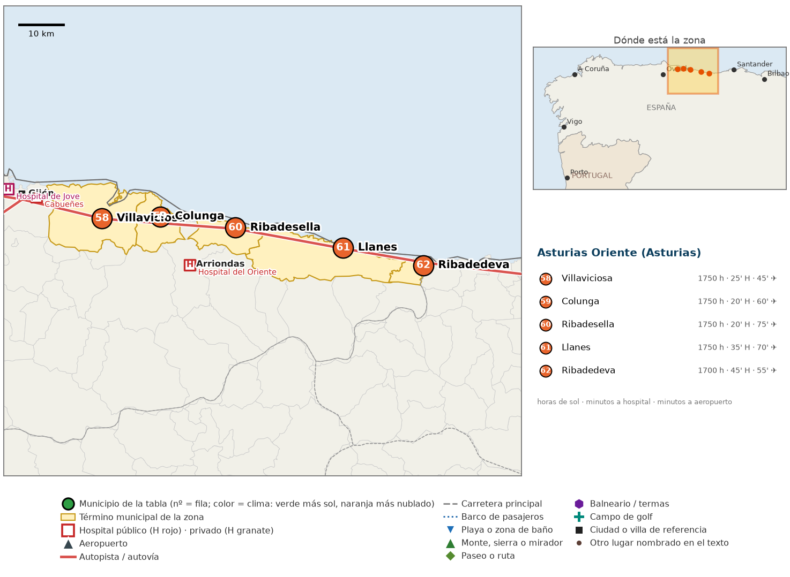

## 12. Asturias Oriente (Asturias) · Villaviciosa, Colunga, Ribadesella, Llanes, Ribadedeva

### La zona

La costa donde la montaña cae al mar: la Sierra del Sueve (1.160 m) sobre Colunga, la Sierra del Cuera (1.300 m) sobre Llanes, y detrás los Picos de Europa a 30-45 min. Villaviciosa es la capital de la sidra, con su ría (reserva natural) y Tazones; Colunga tiene Lastres (pueblo colgado) y el museo del Jurásico; Ribadesella, el Sella, la cueva de Tito Bustillo y el paseo de Santa Marina con sus casas de Indianos; Llanes, la villa amurallada con decenas de playas y pueblos con playa (Barro, Niembro, Celorio, Poo) muy queridos por Madrid; Ribadedeva (Colombres) es la frontera con Cantabria, con el Archivo de Indianos y la cueva del Pindal.

Es la zona más espectacular de la tabla en paisaje y la peor en sol. Sanidad y aeropuerto están en el límite de lo que aceptas.

### Clima mes a mes

| | Oct-Mar | Abr-May | Jun-Sep | Año |
|---|---|---|---|---|
| Días de lluvia al mes | 15-17 | 13-14 | 9-11 | 153-155 |
| Máxima / mínima típica | 13 / 6 °C (ene.) | 17 / 9 °C | 23-24 / 16 °C (jul.) | |
| Horas de sol al mes | 65-100 | 160-190 | 200-220 | 1.700-1.750 |

Sol 1.700-1.750 h (el mínimo de la tabla junto con Cantabria), 40 días despejados, 168 cubiertos. Lluvia 1.200-1.300 mm en 153-155 días, 9-11 al mes en verano. Verano 19,5 °C, 1-3 días > 30 °C. Viento bajo (la sierra protege), niebla media en Villaviciosa. Comparado con Mancor: 1.050-1.100 h de sol menos; casi 100 días de lluvia más.

### Mar y baño

Rodiles (Villaviciosa; larga, pinar, surf), Tazones, La Griega, La Isla y Lastres (Colunga), Santa Marina y Vega (Ribadesella), Toró, Sablón, Puerto Chico, Ballota, Torimbia, Andrín, Barro, Niembro, Poo, Celorio, Gulpiyuri (Llanes: más de 30 playas), La Franca (Ribadedeva). Agua 19-21 °C en agosto. Playas abrigadas entre acantilados, muchas pequeñas; bañarse con calma en Toró, Sablón, Poo, Barro.

### Paseos y montaña

Paseo de San Pedro (Llanes; pradera sobre el acantilado), Bufones de Pría y Arenillas, Sierra del Cuera (rutas desde Llanes), Picos de Europa (Cabrales, Cangas de Onís, Covadonga, Lagos a 45-60 min), Mirador del Fitu (Sueve; una de las vistas mar-montaña más famosas de España), Ermita de la Guía (Ribadesella), cueva de Tito Bustillo, Descenso del Sella (primer sábado de agosto), ría de Villaviciosa, Valdediós (prerrománico), Colombres y la Quinta Guadalupe, cueva del Pindal, Desfiladero de La Hermida (Ribadedeva, 20 min). Para un caminante es la mejor zona de la tabla.

### Servicios y ciudad de referencia

Llanes 7/10 y Ribadesella 7/10 (villas completas con centro de salud, comercio, mercado, cine, restaurantes); Villaviciosa 7/10 (villa de servicios con vida propia); Colunga 4/10; Ribadedeva 3/10 (Unquera y Colombres tienen lo básico; Llanes a 15). Ciudad: Gijón a 25-50 min; Oviedo a 40-70; Torrelavega y Santander a 45-75 desde Ribadedeva.

### Sanidad

Hospital del Oriente (Arriondas, público, comarcal): 20 min desde Colunga y Ribadesella, 35 desde Llanes. Cabueñes (Gijón) a 25 desde Villaviciosa. Sierrallana (Torrelavega) a 45 desde Ribadedeva. Privado: Jove (Gijón) a 30 desde Villaviciosa; ninguno a menos de 45-60 desde el resto. Es la sanidad más débil de la tabla después de la Mariña.

### Aeropuertos y Palma

Asturias (Palma en verano) a 45 min desde Villaviciosa, 60 desde Colunga, 75-85 desde Ribadesella y Llanes. Santander (Palma casi todo el año) a 55 min desde Ribadedeva, 70 desde Llanes, 90 desde Ribadesella, 105-115 desde Colunga y Villaviciosa.

### Precios y qué compras con 260.000 €

Villaviciosa 1.500 €/m² (franja B; 3 habitaciones 142.000), Ribadedeva 1.600 (3 habitaciones franja A 187.000), Colunga 1.700 (199.000), Llanes 2.100 (246.000), Ribadesella 2.200 (257.000). En Llanes, los pueblos con playa (Barro, Niembro, Celorio) superan el presupuesto para 3 habitaciones; la villa y los pueblos interiores entran. Obra nueva: poca o ninguna. Fibra en Villaviciosa, Ribadesella y Llanes; parcial en Colunga y Ribadedeva.

### Seguridad y ambiente

Ninguno supera 20.000 habitantes; Asturias 36/1.000. Población extranjera baja (4-6 %). Ambiente: villas de piedra e Indianos, muy cuidadas, con veraneo madrileño intenso en Llanes y Ribadesella (julio-agosto multiplican por 5-8 su población) y muy tranquilas de octubre a junio.

### Parecido con Mancor / Mallorca

Paisaje 3/5 (pueblo de piedra con la sierra encima, como Fornalutx o Sóller con el mar a 5 min); clima 1/5.

### Lo que no tendrás

- Sol: el mínimo de la tabla.
- Hospital privado cerca ni público a menos de 20-45.
- Ciudad a menos de 25-50 min.
- Obra nueva.
- Calma en Llanes y Ribadesella en julio-agosto.
- Vuelo a Palma a menos de 55-70 min.

### Municipio a municipio

**Villaviciosa (nº 58).** 14.000 habitantes; villa de la sidra (llagares, Fiesta de la Manzana), casco histórico, ría con paseo y observatorio de aves, Tazones (pueblo marinero donde desembarcó Carlos V) y Rodiles a 12 min (franja B), Valdediós a 10. Servicios 7/10. Hospital Cabueñes 25, Jove 30. Aeropuerto de Asturias 45. Precio 1.500: 3 habitaciones 142.000. Fibra sí. Niebla media. Para quién: la más práctica de la zona: villa con vida, Gijón a 25 y hospital a 25, con la ría y la playa a 12.

**Colunga (nº 59).** 3.200 habitantes; Lastres (pueblo colgado sobre el puerto, mirador de San Roque), MUJA, playas de La Griega (huellas de dinosaurio), La Isla y Lastres a 5 min; el Sueve y el Fitu detrás. Servicios 4/10; fibra parcial; coche 7/10. Hospital Arriondas 20. Aeropuerto 60. Precio 1.700: 3 habitaciones 199.000. Para quién: quien quiera el Fitu y Lastres cada día y no necesite servicios a pie.

**Ribadesella (nº 60).** 5.700 habitantes; puerto en la ría del Sella, casco con soportales, paseo de Santa Marina con casas de Indianos, playa urbana, Tito Bustillo, Vega a 10 min; Picos a 30. Servicios 7/10. Hospital 20. Aeropuerto de Asturias 75, Santander 90. Precio 2.200: 2 habitaciones franja A 186.000, 3 habitaciones 257.000 (justo). Poca obra nueva; fibra sí. Facilidad de venta 8/10. Para quién: la más equilibrada de la zona: villa completa, hospital a 20, paisaje total.

**Llanes (nº 61).** 13.000 habitantes; villa amurallada con puerto, Cubos de la Memoria, Paseo de San Pedro, casco histórico, más de 30 playas en el concejo, Sierra del Cuera encima, Picos a 40. Pueblos con playa: Barro, Niembro, Celorio, Poo, Andrín. Servicios 7/10. Hospital Arriondas 35. Aeropuerto de Santander 70, Asturias 85. Precio 2.100: 3 habitaciones franja A 246.000 (en la villa; los pueblos con playa, fuera). Poca obra nueva; fibra sí. Facilidad de venta 8/10, revalorización 8/10. Para quién: quien quiera la villa más completa y bonita del oriente y acepte agosto lleno y hospital a 35.

**Ribadedeva (nº 62).** 1.800 habitantes; Colombres (Archivo de Indianos, casonas de colores), Bustio (ría de Tina Mayor), La Franca (playa entre acantilados), cueva del Pindal, Unquera a 5 min. Servicios 3/10; fibra parcial; coche 8/10. Hospital Sierrallana 45. Aeropuerto de Santander 55 (el mejor tiempo de la zona a Palma). Precio 1.600: 3 habitaciones 187.000. Sin obra nueva. Para quién: quien quiera casa de Indianos con los Picos a 30 min y el aeropuerto de Santander a 55.

### Si yo fuera tú

Ribadesella o Villaviciosa si un día decides que los Picos pesan más que el sol. Con tus prioridades actuales, no: es el clima más opuesto a Mallorca de toda la tabla, y la sanidad y el aeropuerto están en el límite.

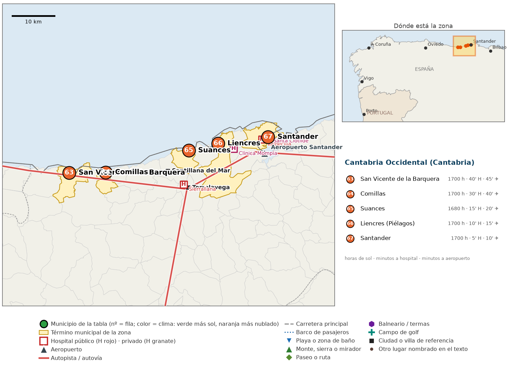

## 13. Cantabria Occidental (Cantabria) · San Vicente de la Barquera, Comillas, Suances, Liencres (Piélagos), Santander

### La zona

De la ría de San Vicente a la bahía de Santander: playas grandes, acantilados, el Parque Natural de las Dunas de Liencres y la Costa Quebrada, y detrás la primera línea de los Picos. Santander (173.000 hab.) es una capital elegante y de servicios completos, con el hospital Valdecilla (uno de los mejores de España) y el aeropuerto con vuelo a Palma casi todo el año a 10 min del centro. Piélagos (Liencres, Mortera, Boo, Mogro) es el municipio residencial de urbanizaciones de casas bajas de la capital y tiene la tasa de criminalidad más baja de todos los municipios medidos en la tabla (31/1.000; criminalidad convencional 16). Suances es villa-playa junto a Torrelavega; Comillas y San Vicente son villas históricas de veraneo.

Es la zona que mejor cumple hospital, aeropuerto y seguridad de toda la tabla, con el sol más bajo.

### Clima mes a mes

| | Oct-Mar | Abr-May | Jun-Sep | Año |
|---|---|---|---|---|
| Días de lluvia al mes | 14-16 | 13-14 | 9-11 | 148-152 |
| Máxima / mínima típica | 13 / 6 °C (ene.) | 17 / 9 °C | 24 / 16 °C (jul.) | |
| Horas de sol al mes | 65-100 | 160-190 | 200-220 | 1.680-1.700 |

Sol 1.680-1.700 h, 38-40 días despejados, 165-168 cubiertos. Lluvia 1.150-1.200 mm en 148-152 días, 9-11 al mes en verano. Verano 20 °C de media, 24 °C de máxima típica, 2-6 días > 30 °C (con viento sur, "ábrego", puntas de 35 °C que duran uno o dos días). Viento medio, niebla baja. Comparado con Mancor: 1.100 h de sol menos; días despejados a un tercio.

### Mar y baño

Merón (San Vicente; 4 km), El Rosal, Oyambre (parque natural), Comillas, La Concha, Los Locos y La Ribera (Suances), Valdearenas, Canallave, Portío, Somocuevas (Liencres; dunas y acantilados de la Costa Quebrada), Sardinero, Magdalena y Mataleñas (Santander). Agua 19-21 °C en agosto. Playas grandes, abiertas, con oleaje; para bañarse tranquilo, la bahía de Santander y las playas del Sardinero en días de calma.

### Paseos y montaña

Dunas de Liencres y Costa Quebrada (Los Urros; geoparque, senda costera); Cabo Mayor y Mataleñas (Santander); Península de la Magdalena; Punta del Dichoso (Suances); ría de San Martín de la Arena; Santillana del Mar y Altamira (10-15 min desde Suances y Comillas); El Capricho de Gaudí y Sobrellano (Comillas); castillo y puente de la Maza (San Vicente); Oyambre; Picos de Europa a 1 h (Potes, Fuente Dé); Cabárceno (parque de la naturaleza, 20 min desde Santander). Golf: Abra del Pas (Mogro, Piélagos), Santa Marina (San Vicente), Mataleñas y Pedreña (Santander). Balnearios: Puente Viesgo y Liérganes a 30 min.

### Servicios y ciudad de referencia

Santander 10/10. Liencres 7/10 (centro de salud, supermercados, farmacias en Liencres y Mortera; Renedo, la capital, y Bezana a 10; Santander a 15). Suances 6/10 (villa con todo lo básico; Torrelavega a 15 con todo). San Vicente 5/10, Comillas 4/10 (villas turísticas de tamaño pequeño). Ciudad de referencia: Santander a 15-20 desde Liencres, 30 desde Suances, 45-55 desde Comillas y San Vicente; Torrelavega (52.000) a 15 desde Suances.

### Sanidad

Valdecilla (Santander, público, de referencia nacional): 5 min desde Santander, 15 desde Liencres, 30 desde Suances. Sierrallana (Torrelavega, público): 15 desde Suances, 30 desde Comillas, 40 desde San Vicente. Privados: Clínica Mompía (Bezana) a 10 desde Liencres y 15 desde Suances; Santa Clotilde (Santander) a 5. Cumple el deseable de 30 en Santander, Liencres, Suances y Comillas; San Vicente en 40.

### Aeropuertos y Palma

Santander-Seve Ballesteros (Palma casi todo el año) a 10 min desde Santander, 15 desde Liencres, 20 desde Suances, 40 desde Comillas, 45 desde San Vicente. Es, con Bilbao, el mejor acceso a Palma de toda la tabla.

### Precios y qué compras con 260.000 €

Suances y Liencres 2.000 €/m² (3 habitaciones franja A 234.000: entra), San Vicente 2.100 (246.000), Comillas 2.400 (281.000: fuera), Santander 2.600 (304.000: fuera; 2 habitaciones 220.000). Obra nueva en Piélagos (municipio en crecimiento) y Santander; poca en el resto. Fibra en los cinco.

### Seguridad y ambiente

Piélagos 31/1.000 (mínimo de la tabla), Santander 51 (ciudad), Torrelavega 47, Camargo 54. Población extranjera 6-8 %. Ambiente: Liencres y Mortera residenciales de clase media santanderina, muchas familias y jubilados; Suances villa de veraneo con vida todo el año; Comillas y San Vicente muy turísticas en verano, tranquilas en invierno; Santander ciudad burguesa, limpia y cara.

### Parecido con Mancor / Mallorca

Urbanismo de Liencres 4/5 (urbanizaciones de casas bajas junto a dunas y acantilados); clima 1/5; paisaje 3/5 (los Picos al fondo, prados verdes).

### Lo que no tendrás

- Sol: 1.700 h y 38-40 días despejados.
- Precio gallego: 2.000-2.600 €/m².
- 3 habitaciones en Comillas o Santander en presupuesto.
- Calma turística en Comillas y San Vicente en verano.
- Hospital cerca desde San Vicente (40).
- Montaña detrás de casa en Liencres y Santander (la costa es llana; los Picos a 1 h).

### Municipio a municipio

**San Vicente de la Barquera (nº 63).** 4.000 habitantes; villa marinera con castillo, iglesia gótica, puente de la Maza, ría con los Picos de fondo (la postal más famosa de Cantabria), Merón y Oyambre. Viento medio. Servicios 5/10. Hospital 40. Aeropuerto 45. Precio 2.100: 3 habitaciones 246.000. Poca obra nueva. Para quién: quien quiera esa vista todos los días y acepte hospital y aeropuerto a 40-45.

**Comillas (nº 64).** 2.200 habitantes; villa modernista (El Capricho de Gaudí, Sobrellano, Universidad Pontificia), plaza de piedra, playa a 2 min, Oyambre, Santillana a 15. Servicios 4/10 (comercio pequeño, muy estacional). Hospital 30. Aeropuerto 40. Precio 2.400: 2 habitaciones franja A 203.000, 3 habitaciones 281.000 (fuera). Para quién: quien quiera vivir en una villa-museo cara y muy cuidada; en invierno, muy tranquila.

**Suances (nº 65).** 9.000 habitantes; villa-playa con casco alto (vistas), puerto en la ría, La Concha (larga, familiar), Los Locos (surf), paseo, Punta del Dichoso; Torrelavega a 15 (todo), Santillana a 10, Santander a 30. Servicios 6/10. Hospital Sierrallana 15, Mompía 15. Aeropuerto 20. Precio 2.000: 3 habitaciones franja A 234.000. Poca obra nueva; fibra sí. Para quién: villa con vida todo el año, playa, y todo a 15-20 min.

**Liencres (Piélagos) (nº 66).** Liencres (2.500 hab.) y Mortera, Boo y Mogro forman la costa de Piélagos (27.000 hab. en el municipio): urbanizaciones de casas bajas y adosados, Parque Natural de las Dunas, playas de Valdearenas y Canallave, acantilados de la Costa Quebrada, Abra del Pas (golf), cercanías desde Boo y Mogro a Santander en 20 min. Servicios 7/10. Hospital Valdecilla 15, Mompía 10. Aeropuerto 15. Precio 2.000: 3 habitaciones franja A 234.000; obra nueva sí; fibra sí. Facilidad de venta 8/10. Seguridad 31/1.000, la mejor de la tabla. Para quién: quien priorice seguridad, hospital y vuelo anual a Palma con urbanización de casas bajas junto al mar; a cambio, el sol de Cantabria.

**Santander (nº 67).** 173.000 habitantes; Sardinero, Magdalena, Cabo Mayor, Centro Botín, paseo de Pereda, bahía; ciudad elegante, limpia y ordenada. Servicios 10/10. Hospital 5. Aeropuerto 10. Ferry a Inglaterra e Irlanda. Precio 2.600: 2 habitaciones franja A 220.000. Obra nueva sí. Seguridad 51. Dependencia del coche 2/10. Para quién: quien prefiera ciudad; para ti, la ciudad de referencia de Liencres.

### Si yo fuera tú

Liencres o Mortera. Es la mejor combinación de seguridad, hospital y aeropuerto con vuelo anual a Palma de toda la tabla, con una urbanización de casas bajas junto a dunas y acantilados. Lo único que la descarta es el sol: 1.700 horas y 40 días despejados frente a los 2.500 y 78 del Val Miñor.

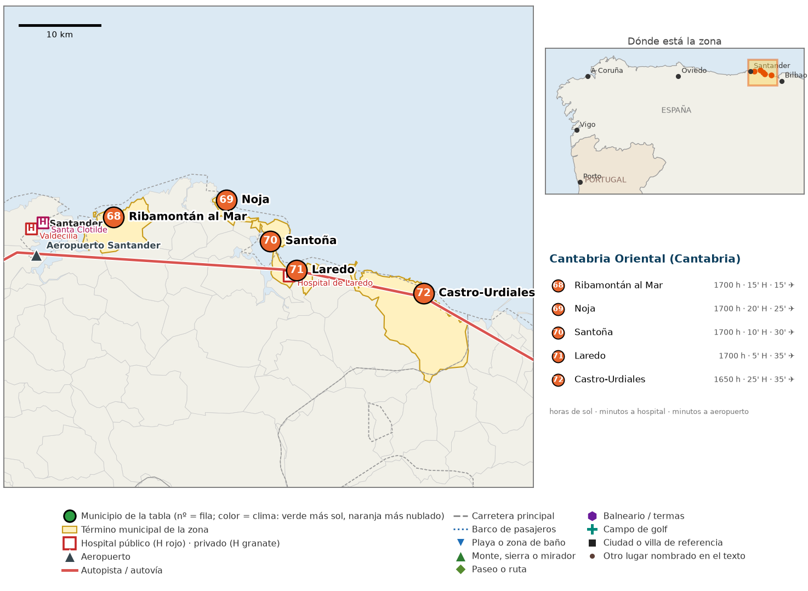

## 14. Cantabria Oriental (Cantabria) · Ribamontán al Mar, Noja, Santoña, Laredo, Castro-Urdiales

### La zona

La costa de Trasmiera y la oriental hasta Bizkaia: Somo y Loredo (7 km de playa, reserva de surf, chalés dispersos de Ribamontán al Mar, lancha a Santander en 30 min), Noja (2.700 habitantes en invierno y 80.000-100.000 en agosto en bloques de apartamentos), Santoña (anchoas, Monte Buciero, Marismas de Santoña), Laredo (5 km de playa, casco medieval y torres de los 60-70) y Castro-Urdiales (34.000 hab., villa medieval convertida en ciudad dormitorio de Bilbao, a 35 min).

Es la zona con el sol más bajo de la tabla y la mejor conectada con Bilbao (aeropuerto con Palma todo el año, hospital de Cruces).

### Clima mes a mes

| | Oct-Mar | Abr-May | Jun-Sep | Año |
|---|---|---|---|---|
| Días de lluvia al mes | 14-17 | 13-14 | 9-11 | 150-155 |
| Máxima / mínima típica | 13 / 6 °C (ene.) | 17 / 9 °C | 24 / 16 °C (jul.) | |
| Horas de sol al mes | 65-95 | 160-185 | 200-215 | 1.650-1.700 |

Sol 1.650-1.700 h (el mínimo de la tabla en Castro), 40 días despejados, 165 cubiertos. Lluvia 1.150-1.250 mm en 150-155 días. Verano 20 °C, 2-6 días > 30 °C. Viento medio en Ribamontán, Noja y Santoña; bajo en Laredo y Castro. Niebla baja. Comparado con Mancor: 1.100-1.150 h de sol menos.

### Mar y baño

Somo, Loredo, Langre (acantilados; naturista), Galizano (Ribamontán); Ris y Trengandín (Noja); Berria y San Martín (Santoña); La Salvé (Laredo; 5 km); Brazomar y Ostende (Castro), Oriñón e Islares (10 min). Agua 19-21 °C. Playas largas y abiertas; para calma, Laredo y la bahía de Santoña.

### Paseos y montaña

Monte Buciero (Santoña; senda al faro del Caballo, 763 escalones); Parque Natural de las Marismas de Santoña, Victoria y Joyel (observatorio de aves, pasarelas); Túnel de la Atalaya (Laredo); senda costera de Cerdigo a Islares y Sonabia (Castro); Real Golf de Pedreña (junto a Ribamontán); Cabárceno a 25 min. Montaña: los Montes de Ordunte y Cerredo (Castro) y la Sierra de Hornijo; los Picos a 1 h 30.

### Servicios y ciudad de referencia

Castro 8/10 (ciudad completa con hospital comarcal a 25 y Bilbao a 35), Laredo 7/10 (villa con todo, hospital comarcal), Santoña 6/10, Ribamontán 5/10 (lo básico repartido; Santander a 20-25), Noja 4-5/10 (dimensionada para el verano; en invierno cierra medio comercio). Ciudad: Santander a 20-30 desde Ribamontán, Noja y Santoña; Bilbao a 35-45 desde Castro y Laredo.

### Sanidad

Hospital de Laredo (público, comarcal): 5 min desde Laredo, 10 desde Santoña, 20 desde Noja, 25 desde Castro. Valdecilla a 15-20 desde Ribamontán, 40-45 desde Laredo y Castro. Cruces (Barakaldo) a 35-40 desde Castro. Privados: Santa Clotilde (Santander) a 15 desde Ribamontán, 35-45 desde el resto; en Bilbao (Quirónsalud, IMQ) a 40 desde Castro.

### Aeropuertos y Palma

Santander (Palma casi todo el año) a 15 min desde Ribamontán, 25 desde Noja, 30 desde Santoña, 35 desde Laredo. Bilbao (Palma todo el año) a 35-40 desde Castro, 50 desde Laredo. Es la única zona de la tabla con vuelo a Palma todo el año a menos de 40 min (desde Castro).

### Precios y qué compras con 260.000 €

Santoña 1.900 €/m² (3 habitaciones franja A 222.000), Laredo 2.100 (246.000), Ribamontán y Noja 2.300 (269.000: fuera en primera línea), Castro 2.400 (281.000: fuera; 2 habitaciones 203.000). Obra nueva en Castro; poca en el resto. Fibra en todos menos Ribamontán (parcial).

### Seguridad y ambiente

Castro 46/1.000; el resto no medidos; Cantabria 43. Población extranjera 6-8 %. Ambiente: Ribamontán rural-residencial y surfero; Noja y Laredo pueblos de veraneo masivo (Burgos, Bilbao, Madrid) muy tranquilos de octubre a mayo; Santoña villa de trabajo (conserva, pesca, prisión de El Dueso); Castro ciudad de trabajadores de Bilbao.

### Parecido con Mancor / Mallorca

2/5. Ribamontán (Loredo, Langre) es lo único con perfil de casas bajas y calma; Laredo y Noja son bloques de veraneo tipo Playa de Palma de los 70.

### Lo que no tendrás

- Sol: el mínimo de toda la tabla.
- Casas bajas en Laredo y Noja.
- Vida en Noja de octubre a mayo.
- 3 habitaciones en primera línea de Castro, Noja o Ribamontán.
- Montaña cerca (salvo el Buciero).
- Precios gallegos.

### Municipio a municipio

**Ribamontán al Mar (nº 68).** 5.500 habitantes en pueblos dispersos: Somo (surf, paseo, lancha a Santander), Loredo, Langre (acantilados), Galizano, Suesa, Carriazo. Casas bajas, chalés, prados, mucha urbanización de segunda residencia. Servicios 5/10; fibra parcial; coche 7/10. Hospital Valdecilla 15-20, Santa Clotilde 15. Aeropuerto 15. Precio 2.300: 2 habitaciones franja A 194.000. Poca obra nueva. Para quién: quien quiera casa baja en zona rural-costera tranquila con Santander enfrente y aeropuerto a 15.

**Noja (nº 69).** 2.700 habitantes en invierno; Ris y Trengandín (largas, con islotes), marismas de Victoria y Joyel, bloques de apartamentos. Servicios 4/10 fuera de temporada. Hospital Laredo 20. Aeropuerto 25. Precio 2.300. Para quién: segunda residencia; no para vivir todo el año.

**Santoña (nº 70).** 11.000 habitantes; villa marinera con vida propia (anchoas, puerto), Monte Buciero, Berria (larga, dunas), fuerte de San Martín, marismas; lancha a Laredo en verano. Servicios 6/10. Hospital 10. Aeropuerto 30. Precio 1.900: 3 habitaciones franja A 222.000. Poca obra nueva. Para quién: quien quiera villa de trabajo con monte y marismas, más barata que sus vecinas.

**Laredo (nº 71).** 11.000 habitantes; La Salvé (5 km), Puebla Vieja (casco medieval, iglesia de la Asunción), puerto deportivo, paseo; torres de apartamentos de los 60-70 en el frente. Servicios 7/10. Hospital 5. Aeropuerto 35. Precio 2.100: 3 habitaciones 246.000. Dependencia del coche 4/10. Para quién: quien quiera hospital a pie y playa enorme, y no le importe el urbanismo de la playa.

**Castro-Urdiales (nº 72).** 34.000 habitantes; villa medieval (Santa María, castillo-faro, puente), paseo, playas de Brazomar y Ostende, Islares y Oriñón a 10, Bilbao a 35. Servicios 8/10, comunicaciones 8/10. Hospital Laredo 25, Cruces 35. Aeropuerto de Bilbao 35-40 (Palma todo el año). Precio 2.400: 2 habitaciones franja A 203.000; 3 habitaciones 281.000 (fuera). Obra nueva sí. Seguridad 46. Para quién: quien quiera ciudad completa con Bilbao al lado y vuelo a Palma todo el año a 40 min, y acepte el sol más bajo de la tabla y precios vascos crecientes.

### Si yo fuera tú

Solo Castro (por Bilbao y el vuelo anual a Palma) o Ribamontán (Loredo, Langre) por casas bajas y calma; y solo si el aeropuerto pasa a ser prioridad. Con sol como prioridad 1, esta zona no.

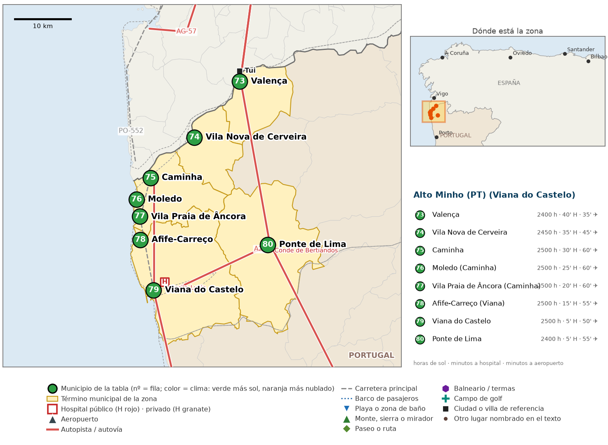

## 15. Alto Minho (Portugal) · Valença, Vila Nova de Cerveira, Caminha, Moledo, Vila Praia de Âncora, Afife-Carreço, Viana do Castelo, Ponte de Lima

### La zona

El norte de Portugal entre el Miño y Viana do Castelo (90.000 hab.), con la Serra d'Arga (825 m) plantada entre el río y el mar. En la costa, aldeas de granito entre el monte y la playa (Afife, Carreço, Areosa), villas de veraneo elegante (Moledo, Vila Praia de Âncora), la desembocadura del Miño (Caminha) y la ciudad de Viana, con la basílica de Santa Luzia sobre ella. En el río, la fortaleza de Valença frente a Tui y la villa de artistas de Cerveira. En el interior, Ponte de Lima, la villa más antigua de Portugal, con su puente romano-medieval sobre el Lima.

Portugal está entre los cinco-siete países más seguros del mundo (Global Peace Index) y su norte es la región más tranquila del país. Los portugueses entienden el castellano y muchos lo hablan. El coste de vida (restaurantes, vino, pescado, servicios, seguros) es inferior al de Galicia; la cesta del supermercado, parecida (Mercadona, Lidl, Continente, Pingo Doce). La sanidad pública es más lenta y hay que contar con seguro privado; el régimen fiscal ventajoso para pensionistas (RNH) se cerró en 2024.

### Clima mes a mes

| | Oct-Mar | Abr-May | Jun-Sep | Año |
|---|---|---|---|---|
| Días de lluvia al mes | 12-15 | 9-11 | 2-5 | 112-120 |
| Máxima / mínima típica | 14 / 5 °C (ene.) | 20 / 10 °C | 25 / 15 °C (jul., costa) · 29-30 / 14 °C (Ponte de Lima) | |
| Horas de sol al mes | 110-150 | 220-250 | 290-320 | 2.400-2.500 |

Sol 2.500 h en la costa (Caminha, Moledo, Âncora, Afife, Viana), 2.400-2.450 en el río y el interior; 78-80 días despejados, 108-112 cubiertos: el mejor cielo de la tabla junto con el Litoral Norte. Lluvia 1.450 mm en la costa (112-115 días), 1.600-1.700 en el interior (118-120). Verano en la costa 20,5 °C, 3-6 días > 30 °C; en Ponte de Lima y Valença 21-21,5 °C, 20-25 días > 30 °C (el verano de Mancor) y niebla alta de valle en invierno (Ponte de Lima). Viento: alto en la costa (la "nortada", viento norte fuerte por las tardes de junio a agosto, marcado en Moledo, Afife y Viana), bajo en el río. Comparado con Mancor: 300-400 h de sol menos; julio y agosto casi tan secos como en Mallorca (2-3 días de lluvia); invierno con 13-15 días de lluvia al mes.

### Mar y baño

Playas atlánticas abiertas y ventosas, con el agua más fría de la tabla (16-18 °C en agosto): Moledo (dunas, pinar, Forte da Ínsua enfrente), Vila Praia de Âncora (con tramo abrigado por el espigón: la mejor para bañarse con calma), Gelfa, Afife (surf), Paçô y Carreço, Praia Norte (Viana; piscinas de marea), Cabedelo (Viana; surf, kite). Foz do Minho (Caminha; estuario, más templado). Praias fluviales en Cerveira y Ponte de Lima. Para bañarse en agua templada, cruzar a Cesantes o a la ría de Vigo (40-60 min desde Valença).

### Paseos y montaña

Serra d'Arga (Santo João d'Arga, aldeas de piedra, caballos, ruta desde Âncora, Caminha o Carreço); Monte de Santa Luzia (Viana; basílica, funicular, citania celta; una de las vistas de mar más citadas de Portugal); farol y molinos de Montedor (Carreço); Camino Portugués de la Costa (pasa por todos los pueblos costeros); Ecovia do Litoral Norte (pasarelas de madera Viana-Caminha); Ecopista do Minho (Valença-Monção, 15 km llanos); Ecovia do Lima y Lagoas de Bertiandos (Ponte de Lima); Fortaleza de Valença (paseo por los baluartes); Alto do Cervo (Cerveira). Termas de Monção y Melgaço a 30-45 min desde Valença; Gerês a 1 h 15 desde Ponte de Lima. Golf: Axis Golfe Ponte de Lima. Es una zona con monte de verdad detrás de casa en toda la costa (Arga) y de granito: la más parecida a la Tramuntana en material.

### Servicios y ciudad de referencia

Viana do Castelo 9/10 (ciudad completa: comercio, hospital, tren, cultura, mercado, paseo). Valença 6/10 (comercio en la fortaleza, Tui a 5). Vila Praia de Âncora 6/10 (villa con vida todo el año). Ponte de Lima 6/10 (villa completa). Cerveira 5/10, Caminha 5/10. Moledo 3/10, Afife-Carreço 3/10 (aldeas; Viana o Âncora a 10-15). Ciudad de referencia: Viana a 10-15 desde Afife-Carreço, 20 desde Âncora, 30 desde Caminha y Cerveira, 25-30 desde Ponte de Lima; Braga (190.000) a 50 desde Ponte de Lima y Viana; Porto a 1 h.

### Sanidad

Hospital de Santa Luzia (Viana, público, ULSAM): 5 min desde Viana, 15 desde Afife-Carreço, 20 desde Âncora, 25 desde Moledo, 30 desde Caminha. Hospital Conde de Bertiandos (Ponte de Lima, público, comarcal): 5 desde Ponte de Lima, 35 desde Cerveira, 40 desde Valença. Privados: Trofa Saúde en Braga (40 desde Ponte de Lima, 50 desde Viana, 60 desde Afife); CUF Porto a 1 h. Desde Valença y Cerveira, Álvaro Cunqueiro (Vigo) queda a 35-45 min, pero como no residente en España solo para urgencias con la tarjeta europea o pagando. Recomendación: seguro privado portugués (100-150 €/mes a los 63) con red en Viana, Braga y Porto.

### Aeropuertos y Palma

Porto-Sá Carneiro (Palma en verano; más de 80 destinos directos) a 50 min desde Viana, 55 desde Afife y Ponte de Lima, 60 desde Caminha, Moledo y Âncora, 75 desde Cerveira. Vigo a 35 desde Valença y 45 desde Cerveira (Palma en verano). Santiago (Palma casi todo el año) a 90-115.

### Precios y qué compras con 260.000 €

Valença 1.300 €/m², Cerveira y Ponte de Lima 1.500, Caminha 1.900, Vila Praia de Âncora 2.000, Afife-Carreço y Viana 2.100, Moledo 2.300. 3 habitaciones franja A: Caminha 222.000, Âncora 234.000, Afife y Viana 246.000 (entran), Moledo 269.000 (fuera). Casa de granito rehabilitada con terreno en Afife, Carreço o Areosa 200.000-280.000. En el interior (franja B), 3 habitaciones por 120.000-140.000 y quintas con viñedo desde 200.000. Obra nueva en Viana y Valença; poca en el resto; ninguna en Moledo. Fibra en todos (Afife-Carreço parcial). Impuestos de compra: IMT (unos 4-6 % efectivo en 260.000 € para vivienda habitual) + Imposto do Selo 0,8 % + notaría y registro.

### Seguridad y ambiente

Sin tasa municipal comparable; Portugal registra menos delitos por habitante que España y el distrito de Viana es de los más tranquilos del país. Población extranjera baja (3-5 %; en Viana algo de comunidad brasileña y de jubilados europeos). Ambiente: aldeas y villas muy cuidadas, gente mayor y familias, veraneo de Porto y Braga en Moledo y Âncora en agosto, Camino de Santiago todo el año; tráfico ligero salvo la N-13 en verano.

### Parecido con Mancor / Mallorca

Afife-Carreço 4/5: aldea de granito con la sierra encima, viñas en pérgola, huertas, y el mar a 3 min; una ciudad completa (Viana) a 10-15 min, como Inca. Ponte de Lima 3/5 en pueblo (piedra, plaza, río), pero con el calor y la niebla que no quieres. Viana ciudad 3/5 como "Inca ideal".

### Lo que no tendrás

- Agua de mar templada (16-18 °C) ni tardes de terraza sin nortada de junio a agosto en la costa.
- Hospital privado a menos de 40-60 min; sanidad pública española.
- Vuelo a Palma todo el año a menos de 90 min.
- Régimen fiscal especial para pensionistas.
- Verano suave en Ponte de Lima y Valença (20-25 días > 30 °C).
- Casas bajas en el centro de Viana (bloques); sí en las freguesias.
- Trámites y papeleo en tu idioma (NIF, CRUE, Finanças, matriculación del coche).

### Municipio a municipio

**Valença (nº 73).** 14.000 habitantes; fortaleza abaluartada del siglo XVII con comercio dentro (textil, restaurantes), Tui a 5 min por el puente, Ecopista do Minho, tren a Porto y a Vigo (Celta). Interior: franja B (Moledo a 25). Verano cálido (21 °C, 20 días > 30 °C), niebla media. Servicios 6/10, comunicaciones 8/10. Hospital Ponte de Lima 40; Vigo 35 (con las limitaciones dichas). Aeropuerto de Vigo 35. Precio 1.300: 3 habitaciones 123.000. Poca obra nueva. Para quién: quien quiera vivir con un pie en cada país por muy poco dinero y acepte calor de verano y playa a 25.

**Vila Nova de Cerveira (nº 74).** 9.000 habitantes; villa cuidada sobre el Miño frente a Goián (puente), castillo, Bienal de Arte, Aquamuseu, praia fluvial, Alto do Cervo (mirador). Franja B (Moledo a 20). Servicios 5/10. Hospital 35. Aeropuerto de Vigo 45, Porto 75. Precio 1.500: 3 habitaciones 142.000. Para quién: quien quiera villa fluvial tranquila y culta, entre Tui y Caminha.

**Caminha (nº 75).** 16.000 habitantes en el concelho; plaza histórica (Torre do Relógio, iglesia matriz), desembocadura del Miño con el pinar y el fuerte de la Ínsua, ferry a A Guarda, Serra d'Arga detrás. Playas de Foz do Minho y Moledo a 5 min. Viento medio. Servicios 5/10. Hospital 30. Aeropuerto 60. Precio 1.900: 3 habitaciones franja A 222.000. Poca obra nueva. Para quién: quien quiera villa histórica en la boca del Miño con Galicia enfrente.

**Moledo (Caminha) (nº 76).** 1.500 habitantes; el veraneo tradicional de la burguesía de Porto: chalés entre pinos, playa larga con dunas y viento (kite, surf), el fuerte de la Ínsua y Santa Trega enfrente. Viento alto. Servicios 3/10; coche 7/10. Hospital 25. Aeropuerto 60. Precio 2.300 (el más caro de la zona): 2 habitaciones franja A 194.000; 3 habitaciones 269.000 (fuera). Sin obra nueva. Para quién: quien quiera pinar, playa y ambiente elegante y tranquilo, y no le moleste el viento de las tardes.

**Vila Praia de Âncora (Caminha) (nº 77).** 5.000 habitantes; villa marinera con puerto, fortaleza de Lagarteira, playa con tramo abrigado por el espigón (la mejor para bañarse de la zona), Gelfa (pinar y dunas), mercado, tren (Viana 20 min, Porto 1 h 30), Serra d'Arga por el valle del Âncora. Viento medio. Servicios 6/10. Hospital 20. Aeropuerto 60. Precio 2.000: 3 habitaciones franja A 234.000. Poca obra nueva; fibra sí. Para quién: quien quiera villa con vida todo el año, servicios a pie y playa abrigada, a 20 min de Viana.

**Afife-Carreço (Viana) (nº 78).** Afife (1.500 hab.) y Carreço (1.800), con Areosa a continuación, son las freguesias del norte de Viana: aldeas de granito entre la Serra d'Arga y el mar, viñas en pérgola, huertas, molinos y faro de Montedor, playas de Afife (surf) y Paçô a 3 min, apeaderos de tren. Viento alto en la playa, bajo en la aldea (protegida por la ladera). Servicios 3/10; coche 7/10; fibra parcial. Hospital Viana 15. Aeropuerto 55. Precio 2.100: 3 habitaciones franja A 246.000; casa de granito con terreno 200.000-280.000. Poca obra nueva. Para quién: el que quiera Mancor con el mar a 3 min y Viana a 10-15 como Inca. Mi elección en Portugal.

**Viana do Castelo (nº 79).** 90.000 habitantes en el concelho (40.000 en la ciudad); Santa Luzia, Praça da República, puente Eiffel, buque-hospital Gil Eannes, paseo del Lima, Praia Norte con piscinas, Cabedelo (surf) al otro lado del río, mercado, tren, comercio. Ciudad limpia, tranquila y culta. Servicios 9/10. Hospital 5. Aeropuerto de Porto 50. Precio 2.100: 3 habitaciones franja A 246.000; obra nueva sí. Facilidad de venta 8/10, revalorización 8/10. Dependencia del coche 3/10. Para quién: quien prefiera ciudad pequeña completa; para ti, la ciudad de referencia de Afife-Carreço.

**Ponte de Lima (nº 80).** 44.000 habitantes en el concelho (3.000 en la villa); puente romano-medieval, plaza de la feria, Feiras Novas (septiembre), Festival de Jardines, Ecovia do Lima, Lagoas de Bertiandos, viñedo de Loureiro, golf. Interior: franja B (Cabedelo a 25). Verano caluroso (21,5 °C, 20-25 días > 30 °C), niebla alta en invierno. Servicios 6/10. Hospital a 5 (comarcal). Aeropuerto 55. Precio 1.500: 3 habitaciones 142.000; quinta con viñedo 200.000-300.000. Para quién: la villa más bonita del interior, para quien no le importe el calor de julio-agosto ni la niebla de diciembre-enero, y tenga el mar a 25.

### Si yo fuera tú

Afife, Carreço o Areosa (aldea de granito con monte y mar, Viana a 10-15) o Vila Praia de Âncora (villa con servicios y playa abrigada). Es mi tercera opción de toda la tabla, con la sanidad privada y el papeleo portugués como precio, y el viento de las tardes de verano como sorpresa a comprobar en persona en julio.

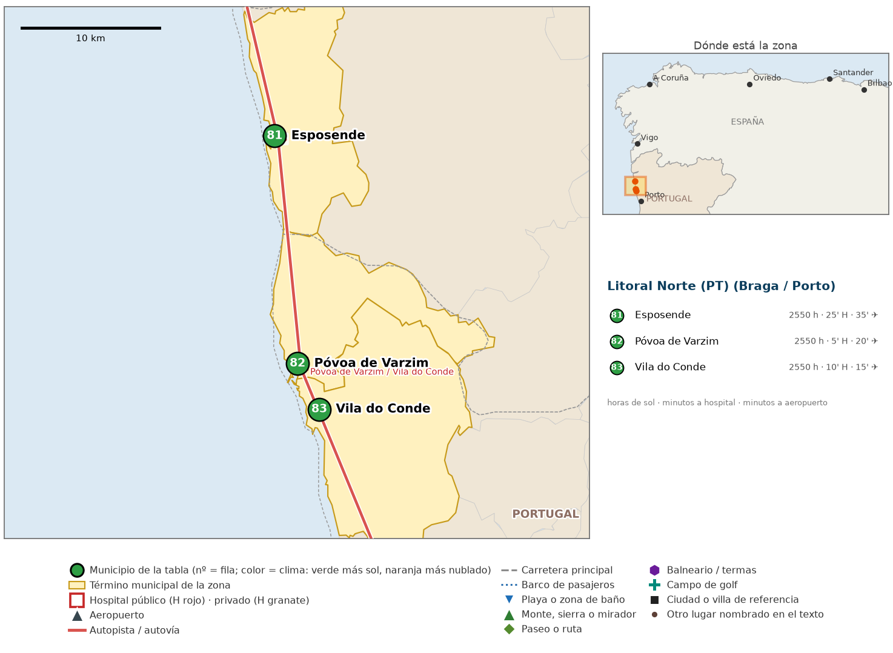

## 16. Litoral Norte (Portugal) · Esposende, Póvoa de Varzim, Vila do Conde

### La zona

La costa llana al norte de Porto: Esposende (34.000 hab.; Ofir entre pinos, Apúlia con sus molinos sobre las dunas, el estuario del Cávado y el Parque Natural do Litoral Norte), Póvoa de Varzim (63.000; ciudad-balneario con casino, paseo y bloques en primera línea) y Vila do Conde (80.000; casco histórico con el acueducto y el convento de Santa Clara, astilleros históricos, Azurara). El metro de Porto (línea B) llega a Póvoa y Vila do Conde; la A28 lleva a Porto en 30-40 min; el aeropuerto de Sá Carneiro está a 15-35.

Es la zona con más sol de toda la tabla y el mejor aeropuerto para viajar en la jubilación. Le falta montaña, casas bajas en los frentes de mar y agua templada.

### Clima mes a mes

| | Oct-Mar | Abr-May | Jun-Sep | Año |
|---|---|---|---|---|
| Días de lluvia al mes | 11-14 | 8-10 | 2-4 | 105-108 |
| Máxima / mínima típica | 14 / 5 °C (ene.) | 20 / 10 °C | 25 / 15 °C (jul.) | |
| Horas de sol al mes | 120-150 | 230-260 | 300-330 | 2.550 |

Sol 2.550 h, 85 días despejados, 105 cubiertos: el máximo de la tabla. Lluvia 1.200-1.300 mm en 105-108 días (los menos días de la tabla), con julio y agosto casi secos (2 días). Verano 20 °C, máximas de 25 °C, 3-6 días > 30 °C. Viento alto (nortada de tarde de junio a agosto). Niebla media (nieblas de mar por la mañana en verano). Comparado con Mancor: 250 h de sol menos, 50 días de lluvia más (de octubre a abril), verano igual de seco pero 5 °C más fresco.

### Mar y baño

Ofir y Esposende (estuario del Cávado, la única agua abrigada), Apúlia, Fão, Cepães, Praia da Póvoa (Redonda, Salgueira, Lagoa), Vila do Conde, Azurara (surf), Mindelo (reserva ornitológica). Agua 16-18 °C en agosto: fría. Mar abierto, olas y viento de tarde. Para bañarse con calma, el estuario de Esposende y las piscinas.

### Paseos y montaña

Parque Natural do Litoral Norte (pasarelas de madera sobre dunas, 16 km entre Apúlia y la Foz do Cávado); molinos de Apúlia; paseo marítimo de Póvoa (uno de los más largos de Portugal) y de Vila do Conde; acueducto y Santa Clara; Nau Quinhentista; reserva de Mindelo; Estela Golf (Póvoa, links junto al mar). Montaña: no; las sierras de Rates y Franqueira son colinas de 300-400 m. Gerês a 1 h 30.

### Servicios y ciudad de referencia

Póvoa 8/10 y Vila do Conde 8/10 (ciudades completas con hospital, metro, mercado, comercio, cultura); Esposende 6/10 (villa completa; Braga a 30 con todo). Ciudad de referencia: la propia en Póvoa y Vila do Conde; Porto (230.000, área de 1,7 millones) a 40 min en coche o 60-70 en metro; Braga a 30 desde Esposende.

### Sanidad

Hospital Póvoa de Varzim / Vila do Conde (público, comarcal): 5 min desde Póvoa, 10 desde Vila do Conde, 25 desde Esposende. Hospital de Braga (público, de referencia) a 30 desde Esposende. Privados: CUF Porto a 30 desde Vila do Conde y 35 desde Póvoa; Trofa Saúde Braga a 40 desde Esposende; hospitales de Porto (São João, Santo António) a 40. Seguro privado recomendable, como en el Alto Minho.

### Aeropuertos y Palma

Porto-Sá Carneiro a 15 min desde Vila do Conde, 20 desde Póvoa, 35 desde Esposende: Palma en verano y más de 80 destinos directos todo el año. Santiago (Palma casi todo el año) a 2 h.

### Precios y qué compras con 260.000 €

Esposende 2.300 €/m², Póvoa y Vila do Conde 2.600. 2 habitaciones franja A: 194.000-220.000 (entran); 3 habitaciones: Esposende 269.000 (justo fuera; entra a 5-10 min de la playa), Póvoa y Vila do Conde 304.000 (fuera). Obra nueva en los tres (mucha en Póvoa y Vila do Conde). Fibra en los tres.

### Seguridad y ambiente

Portugal, país muy seguro; el área de Porto tiene más incidencia que el Minho pero muy inferior a Palma. Población extranjera creciente en el área metropolitana (brasileños, sobre todo), 5-8 %. Ambiente: Póvoa y Vila do Conde son ciudades de playa vivas todo el año, con mucho veraneante de Porto en agosto; Esposende es residencial y familiar. Tráfico: la A28 hacia Porto se congestiona en hora punta.

### Parecido con Mancor / Mallorca

2/5 en general (llanura, bloques, viento). 3/5 en Ofir y Apúlia (casas bajas entre pinos y dunas, tipo Sa Ràpita o Es Trenc).

### Lo que no tendrás

- Montaña detrás.
- Casas bajas en el frente de mar de Póvoa y Vila do Conde.
- Agua de mar templada ni tarde de terraza sin viento en verano.
- 3 habitaciones en primera línea dentro de 260.000 €.
- Hospital privado a menos de 30-40 min.
- Vuelo a Palma todo el año.
- Sanidad pública española.

### Municipio a municipio

**Esposende (nº 81).** 34.000 habitantes en el concelho; Esposende villa (estuario, paseo, puerto), Ofir (urbanización de veraneo de Braga entre pinos, torres de los 70 y chalés), Fão (villa antigua), Apúlia (molinos, dunas, playa), Marinhas. Parque Natural do Litoral Norte. Viento alto. Servicios 6/10. Hospital Póvoa 25, Braga 30. Aeropuerto 35. Precio 2.300: 2 habitaciones franja A 194.000; 3 habitaciones 269.000 (entra a 5-10 min). Obra nueva sí. Para quién: la opción residencial y tranquila del Litoral Norte, con Braga y Porto a 30-40. Mi elección en la zona.

**Póvoa de Varzim (nº 82).** 63.000 habitantes; ciudad de playa con casino, paseo marítimo largo, puerto pesquero, mercado, metro a Porto, Estela Golf a 10 min. Servicios 8/10. Hospital 5. Aeropuerto 20. Precio 2.600: 2 habitaciones franja A 220.000; obra nueva abundante. Facilidad de venta 9/10. Dependencia del coche 3/10. Para quién: quien quiera ciudad de playa con metro y aeropuerto a 20 min; el urbanismo del frente es de bloques.

**Vila do Conde (nº 83).** 80.000 habitantes; casco histórico (Santa Clara, acueducto de 999 arcos, Alfândega, Nau), río Ave, playas de Vila do Conde y Azurara, Mindelo a 10, metro y A28. Servicios 8/10, comunicaciones 9/10. Hospital 10; CUF Porto 30. Aeropuerto 15 (el más rápido de toda la tabla junto a Vigo y A Coruña). Precio 2.600: 2 habitaciones franja A 220.000; obra nueva sí. Dependencia del coche 3/10. Para quién: quien quiera ciudad histórica con el aeropuerto a un cuarto de hora y Porto a media hora.

### Si yo fuera tú

Esposende (Ofir o Apúlia) si quieres el máximo sol de la tabla y el mejor aeropuerto para viajar, y aceptas que la montaña quede lejos, el mar esté frío y el viento sople por las tardes de verano.

---

## Cierre: si yo fuera tú, en orden

1. **Val Miñor (Gondomar, Nigrán, Baiona).** El máximo sol de España en la tabla, hospital y aeropuerto a 15-25, Vigo a 20, monte detrás, parroquias y urbanizaciones de casas bajas. Renuncias: precio en Nigrán y Baiona, verano lleno en Baiona, Palma anual a 85 min.
2. **Poio (Pontevedra e Sanxenxo).** Pueblo de piedra sobre la ría, Pontevedra a 5-10, hospital público y privado a 10, aeropuerto a 25, 3 habitaciones en presupuesto. Renuncias: 200 h de sol menos que el Val Miñor, montaña suave.
3. **Alto Minho costa (Afife-Carreço, Vila Praia de Âncora).** Aldeas de granito con monte y mar, Viana a 10-15, 2.500 h de sol, Porto a 1 h, país muy seguro y más barato. Renuncias: mar frío, nortada, sanidad privada obligatoria, papeleo.
4. **O Salnés y Barbanza (Cambados, Meaño, Boiro, A Pobra).** Viñedo o sierra, ría templada y seca, Santiago (Palma casi todo el año) a 45-55, 3 habitaciones por 150.000-180.000. Renuncias: ciudad buena a 25-45, sin privado cerca en el Barbanza.
5. **Vigo e ría (Redondela, Vigo-Coruxo).** La mejor logística de la tabla. Renuncias: entorno más urbano, menos sol.
6. **Litoral Norte (Esposende).** El máximo sol y el mejor aeropuerto para viajar. Renuncias: sin montaña, mar frío, viento.
7. **Golfo Ártabro (Oleiros, Costa Miño).** La urbanización perfecta con A Coruña a 10. Renuncias: 50 días despejados al año.
8. **Cantabria Occidental (Liencres, Suances).** Seguridad máxima, Valdecilla, Palma casi todo el año a 15 min. Renuncias: 1.700 h de sol.
9. **Baixo Miño (O Rosal, Tui).** El paisaje más parecido a Mancor. Renuncias: hospital a 30-45, ciudad a 40.
10. **O Morrazo (Cangas, Marín).** Mar y senderos de costa. Renuncias: el puente de Rande para todo.
11. **Asturias Centro (Salinas).** Logística asturiana completa. Renuncias: 1.800 h de sol, industria cercana.
12. **Asturias Oriente (Ribadesella, Villaviciosa).** Los Picos sobre el mar. Renuncias: el sol más bajo, sin privado.
13. **Cantabria Oriental (Ribamontán, Castro).** Bilbao y Palma todo el año. Renuncias: sol mínimo, urbanismo de bloques.
14. **Asturias Occidente (Luarca).** Encanto. Renuncias: todo lo demás.
15. **A Mariña.** Precio. Renuncias: todo lo que has puesto como prioridad.

## Pendiente de hablar: datos que añadiría a la tabla

Recordatorio de la conversación anterior; falta decidir cuáles incorporar al esquema y regenerar las hojas:

- Calor: máxima media de julio y días > 30 °C al año por municipio (AEMET / IPMA).
- Seguridad y población: tasa de criminalidad (Interior; provincial para los de menos de 20.000 hab.), % de población extranjera (INE), densidad de población, tipo de edificación predominante, plazas turísticas por habitante (saturación de agosto), evolución de población 2015-2025.
- Coste de vida: índice OCU de la cesta de la compra de la ciudad de referencia, cadenas a ≤ 10 min, menú del día de referencia, fiscalidad autonómica (ITP, IBI, sucesiones; IMT e IMI en Portugal).
- Vida de jubilado: ciudad de referencia y minutos en hora punta y valle; aseguradoras con cuadro en el hospital privado más cercano; golf, puerto deportivo, piscina climatizada y pádel a ≤ 15 min; rutas señalizadas; balneario más cercano; destinos directos del aeropuerto principal; mercado semanal y presencia de jubilados llegados de fuera.
- Riesgos del norte: zona de radón (CSN), riesgo de incendio forestal, coste real de calefacción y deshumidificación.
- Fila fija "Mancor de la Vall (referencia)" en la hoja 3 para leer cada municipio como diferencia respecto a lo que tienes.
